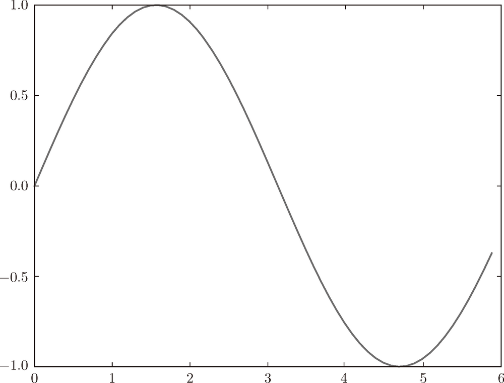
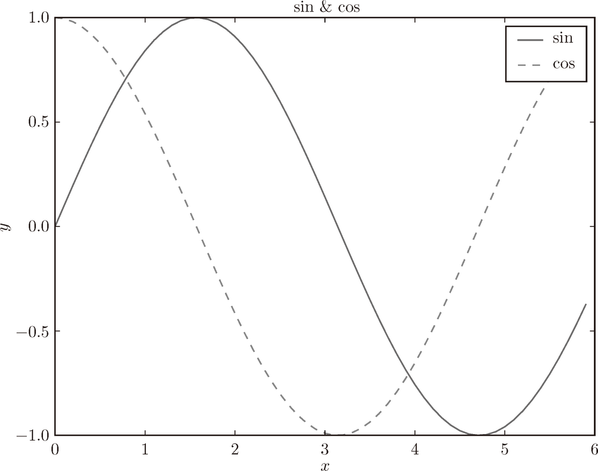

第1章 Python 入门


Python 这一编程语言已经问世 20 多年了，在这期间，Python 不仅完成了自身的进化，还获得了大量的用户。现在，Python 作为最具人气的编程语言，受到了许多人的喜爱。

接下来我们将使用 Python 实现深度学习系统。不过在这之前，本章将简单地介绍一下 Python，看一下它的使用方法。已经掌握了 Python、NumPy、Matplotlib 等知识的读者，可以跳过本章，直接阅读后面的章节。

### 1.1　Python 是什么

Python 是一个简单、易读、易记的编程语言，而且是开源的，可以免费地自由使用。Python 可以用类似英语的语法编写程序，编译起来也不费力，因此我们可以很轻松地使用 Python。特别是对首次接触编程的人士来说，Python 是最合适不过的语言。事实上，很多高校和大专院校的计算机课程均采用 Python 作为入门语言。

此外，使用 Python 不仅可以写出可读性高的代码，还可以写出性能高（处理速度快）的代码。在需要处理大规模数据或者要求快速响应的情况下，使用 Python 可以稳妥地完成。因此，Python 不仅受到初学者的喜爱，同时也受到专业人士的喜爱。实际上，Google、Microsoft、Facebook 等战斗在 IT 行业最前沿的企业也经常使用 Python。

再者，在科学领域，特别是在机器学习、数据科学领域，Python 也被大量使用。Python 除了高性能之外，凭借着 NumPy、SciPy 等优秀的数值计算、统计分析库，在数据科学领域占有不可动摇的地位。深度学习的框架中也有很多使用 Python 的场景，比如 Caffe、TensorFlow、Chainer、Theano 等著名的深度学习框架都提供了 Python 接口。因此，学习 Python 对使用深度学习框架大有益处。

综上，Python 是最适合数据科学领域的编程语言。而且，Python 具有受众广的优秀品质，从初学者到专业人士都在使用。因此，为了完成的从零开始实现深度学习的目标，Python 可以说是最合适的工具。

### 1.2　Python 的安装

下面，我们首先将 Python 安装到当前环境（电脑）上。这里说明一下安装时需要注意的一些地方。

#### 1.2.1　Python 版本

Python 有 Python 2.*x* 和 Python 3.*x* 两个版本。如果我们调查一下目前 Python 的使用情况，会发现除了最新的版本 3.*x* 以外，旧的版本 2.*x* 仍在被大量使用。因此，在安装 Python 时，需要慎重选择安装 Python 的哪个版本。这是因为两个版本之间没有兼容性（严格地讲，是没有“向后兼容性”），也就是说，会发生用 Python 3.*x* 写的代码不能被 Python 2.*x* 执行的情况。中使用 Python 3.*x* ，只安装了 Python 2.*x* 的读者建议另外安装一下 Python 3.*x*。

#### 1.2.2　使用的外部库

的目标是从零开始实现深度学习。因此，除了 NumPy 库和 Matplotlib 库之外，我们极力避免使用外部库。之所以使用这两个库，是因为它们可以有效地促进深度学习的实现。

NumPy 是用于数值计算的库，提供了很多高级的数学算法和便利的数组（矩阵）操作方法。中将使用这些便利的方法来有效地促进深度学习的实现。

Matplotlib 是用来画图的库。使用 Matplotlib 能将实验结果可视化，并在视觉上确认深度学习运行期间的数据。

> 将使用下列编程语言和库。
>
> - Python 3.*x*（2016 年 8 月时的最新版本是 3.5）
> - NumPy
> - Matplotlib

下面将为需要安装 Python 的读者介绍一下 Python 的安装方法。已经安装了 Python 的读者，请跳过这一部分内容。

#### 1.2.3　Anaconda 发行版

Python 的安装方法有很多种，推荐使用 Anaconda 这个发行版。发行版集成了必要的库，使用户可以一次性完成安装。Anaconda 是一个侧重于数据分析的发行版，前面说的 NumPy、Matplotlib 等有助于数据分析的库都包含在其中 {1[Anaconda 作为一个针对数据分析的发行版，包含了许多有用的库，而中实际上只会使用其中的 NumPy 库和 Matplotlib 库。因此，如果想保持轻量级的开发环境，单独安装这两个库也是可以的。 ——]}。

如前所述，将使用 Python 3.*x* 版本，因此 Anaconda 发行版也要安装 3.*x* 的版本。请读者从官方网站下载与自己的操作系统相应的发行版，然后安装。

### 1.3　Python 解释器

完成 Python 的安装后，要先确认一下 Python 的版本。打开终端（Windows 中的命令行窗口），输入 `python --version` 命令，该命令会输出已经安装的 Python 的版本信息。

```
$ python --version
Python 3.4.1 :: Anaconda 2.1.0 (x86_64)
```

如上所示，显示了 Python 3.4.1（根据实际安装的版本，版本号可能不同），说明已正确安装了 Python 3.*x*。接着输入 `python`，启动 Python 解释器。

```
$ python
Python 3.4.1 |Anaconda 2.1.0 (x86_64)| (default, Sep 10 2014, 17:24:09)
[GCC 4.2.1 (Apple Inc. build 5577)] on darwin
Type "help", "copyright", "credits" or "license" for more information.
>>>
```

Python 解释器也被称为“对话模式”，用户能够以和 Python 对话的方式进行编程。比如，当用户询问“1 + 2 等于几？”的时候，Python 解释器会回答“3”，所谓对话模式，就是指这样的交互。现在，我们实际输入一下看看。

```
>>> 1 + 2
3
```

Python 解释器可以像这样进行对话式（交互式）的编程。下面，我们使用这个对话模式，来看几个简单的 Python 编程的例子。

#### 1.3.1　算术计算

加法或乘法等算术计算，可按如下方式进行。

```
>>> 1 - 2
-1
>>> 4 * 5
20
>>> 7 / 5
1.4
>>> 3 ** 2
9
```

`*` 表示乘法，`/` 表示除法，`**` 表示乘方（`3**2` 是 3 的 2 次方）。另外，在 Python 2.*x* 中，整数除以整数的结果是整数，比如，7 ÷ 5 的结果是 1。但在 Python 3.*x* 中，整数除以整数的结果是小数（浮点数）。

#### 1.3.2　数据类型

编程中有**数据类型**（data type）这一概念。数据类型表示数据的性质，有整数、小数、字符串等类型。Python 中的 `type()` 函数可以用来查看数据类型。

```
>>> type(10)
<class 'int'>
>>> type(2.718)
<class 'float'>
>>> type("hello")
<class 'str'>
```

根据上面的结果可知，`10` 是 `int` 类型（整型），`2.718` 是 `float` 类型（浮点型），`"hello"` 是 `str`（字符串）类型。另外，“类型”和“类”这两个词有时用作相同的意思。这里，对于输出结果 `<class 'int'>`，可以将其解释成“`10` 是 `int` 类（类型）”。

#### 1.3.3　变量

可以使用 `x` 或 `y` 等字母定义**变量**（variable）。此外，可以使用变量进行计算，也可以对变量赋值。

```
>>> x = 10   # 初始化
>>> print(x) # 输出x
10
>>> x = 100 # 赋值
>>> print(x)
100
>>> y = 3.14
>>> x * y
314.0
>>> type(x * y)
<class 'float'>
```

Python 是属于“动态类型语言”的编程语言，所谓动态，是指变量的类型是根据情况自动决定的。在上面的例子中，用户并没有明确指出“`x` 的类型是 `int`（整型）”，是 Python 根据 `x` 被初始化为 10，从而判断出 `x` 的类型为 `int` 的。此外，我们也可以看到，整数和小数相乘的结果是小数（数据类型的自动转换）。另外，“`#`”是注释的意思，它后面的文字会被 Python 忽略。

#### 1.3.4　列表

除了单一的数值，还可以用列表（数组）汇总数据。

```
>>> a = [1, 2, 3, 4, 5] # 生成列表
>>> print(a) # 输出列表的内容
[1, 2, 3, 4, 5]
>>> len(a)   # 获取列表的长度
5
>>> a[0]     # 访问第一个元素的值
1
>>> a[4]
5
>>> a[4] = 99 # 赋值
>>> print(a)
[1, 2, 3, 4, 99]
```

元素的访问是通过 `a[0]` 这样的方式进行的。`[]` 中的数字称为索引（下标），索引从 0 开始（索引 0 对应第一个元素）。此外，Python 的列表提供了**切片**（slicing）这一便捷的标记法。使用切片不仅可以访问某个值，还可以访问列表的子列表（部分列表）。

```
>>> print(a)
[1, 2, 3, 4, 99]
>>> a[0:2] # 获取索引为0到2（不包括2！）的元素
[1, 2]
>>> a[1:]  # 获取从索引为1的元素到最后一个元素
[2, 3, 4, 99]
>>> a[:3]  # 获取从第一个元素到索引为3（不包括3！）的元素
[1, 2, 3]
>>> a[:-1] # 获取从第一个元素到最后一个元素的前一个元素之间的元素
[1, 2, 3, 4]
>>> a[:-2] # 获取从第一个元素到最后一个元素的前二个元素之间的元素
[1, 2, 3]
```

进行列表的切片时，需要写成 `a[0:2]` 这样的形式。`a[0:2]` 用于取出从索引为 0 的元素到索引为 2 的元素的前一个元素之间的元素。另外，索引 -1 对应最后一个元素，-2 对应最后一个元素的前一个元素。

#### 1.3.5　字典

列表根据索引，按照 0, 1, 2, ... 的顺序存储值，而字典则以键值对的形式存储数据。字典就像《新华字典》那样，将单词和它的含义对应着存储起来。

```
>>> me = {'height':180} # 生成字典
>>> me['height']        # 访问元素
180
>>> me['weight'] = 70   # 添加新元素
>>> print(me)
{'height': 180, 'weight': 70}
```

#### 1.3.6　布尔型

Python 中有 `bool` 型。`bool` 型取 `True` 或 `False` 中的一个值。针对 `bool` 型的运算符包括 `and`、`or` 和 `not`（针对数值的运算符有 `+`、`-`、`*`、`/` 等，根据不同的数据类型使用不同的运算符）。

```
>>> hungry = True     # 饿了？
>>> sleepy = False    # 困了？
>>> type(hungry)
<class 'bool'>
>>> not hungry
False
>>> hungry and sleepy # 饿并且困
False
>>> hungry or sleepy  # 饿或者困
True
```

#### 1.3.7　if 语句

根据不同的条件选择不同的处理分支时可以使用 `if/else` 语句。

```
>>> hungry = True
>>> if hungry:
...     print("I'm hungry")
...
I'm hungry
>>> hungry = False
>>> if hungry:
...     print("I'm hungry") # 使用空白字符进行缩进
... else:
...     print("I'm not hungry")
...     print("I'm sleepy")
...
I'm not hungry
I'm sleepy
```

Python 中的空白字符具有重要的意义。上面的 `if` 语句中，`if hungry:` 下面的语句开头有 4 个空白字符。它是缩进的意思，表示当前面的条件（`if hungry`）成立时，此处的代码会被执行。这个缩进也可以用 tab 表示，Python 中推荐使用空白字符。

> Python 使用空白字符表示缩进。一般而言，每缩进一次，使用 4 个空白字符。

#### 1.3.8　for 语句

进行循环处理时可以使用 `for` 语句。

```
>>> for i in [1, 2, 3]:
...     print(i)
...
1
2
3
```

这是输出列表 `[1, 2, 3]` 中的元素的例子。使用 `for … in … :` 语句结构，

可以按顺序访问列表等数据集合中的各个元素。

#### 1.3.9　函数

可以将一连串的处理定义成**函数**（function）。

```
>>> def hello():
...     print("Hello World!")
...
>>> hello()
Hello World!
```

此外，函数可以取参数。

```
>>> def hello(object):
...     print("Hello " + object + "!")
...
>>> hello("cat")
Hello cat!
```

另外，字符串的拼接可以使用 `+`。

关闭 Python 解释器时，Linux 或 Mac OS X 的情况下输入 Ctrl-D（按住 Ctrl，再按 D 键）；Windows 的情况下输入 Ctrl-Z，然后按 Enter 键。

### 1.4　Python 脚本文件

到目前为止，我们看到的都是基于 Python 解释器的例子。Python 解释器能够以对话模式执行程序，非常便于进行简单的实验。但是，想进行一连串的处理时，因为每次都需要输入程序，所以不太方便。这时，可以将 Python 程序保存为文件，然后（集中地）运行这个文件。下面，我们来看一个 Python 脚本文件的例子。

#### 1.4.1　保存为文件

打开文本编辑器，新建一个 `hungry.py` 的文件。`hungry.py` 只包含下面一行语句。

```
print("I'm hungry!")
```

接着，打开终端（Windows 中的命令行窗口），移至 `hungry.py` 所在的位置。然后，将 `hungry.py` 文件名作为参数，运行 `python` 命令。这里假设 `hungry.py` 在`~/deep-learning-from-scratch/ch01` 目录下（在提供的源代码中，`hungry.py` 文件位于 `ch01` 目录下）。

```
$ cd ~/deep-learning-from-scratch/ch01 # 移动目录
$ python hungry.py
I'm hungry!
```

这样，使用 `python hungry.py` 命令就可以执行这个 Python 程序了。

#### 1.4.2　类

前面我们了解了 `int` 和 `str` 等数据类型（通过 `type()` 函数可以查看对象的类型）。这些数据类型是“内置”的数据类型，是 Python 中一开始就有的数据类型。现在，我们来定义新的类。如果用户自己定义类的话，就可以自己创建数据类型。此外，也可以定义原创的方法（类的函数）和属性。

Python 中使用 `class` 关键字来定义类，类要遵循下述格式（模板）。

```
class 类名：
    def __init__(self, 参数, …): # 构造函数
       ...
    def 方法名1(self, 参数, …):  # 方法1
       ...
    def 方法名2(self, 参数, …):  # 方法2
       ...
```

这里有一个特殊的 `init` 方法，这是进行初始化的方法，也称为**构造函数**（constructor）,只在生成类的实例时被调用一次。此外，在方法的第一个参数中明确地写入表示自身（自身的实例）的 `self` 是 Python 的一个特点（学过其他编程语言的人可能会觉得这种写 `self` 的方式有一点奇怪）。

下面我们通过一个简单的例子来创建一个类。这里将下面的程序保存为 `man.py`。

```
class Man:
    def __init__(self, name):
        self.name = name
        print("Initialized!")

    def hello(self):
        print("Hello " + self.name + "!")

    def goodbye(self):
        print("Good-bye " + self.name + "!")

    m = Man("David")
    m.hello()
    m.goodbye()
```

从终端运行 `man.py`。

```
$ python man.py
Initialized!
Hello David!
Good-bye David!
```

这里我们定义了一个新类 `Man`。上面的例子中，类 `Man` 生成了实例（对象）`m`。

类 `Man` 的构造函数（初始化方法）会接收参数 `name`，然后用这个参数初始化实例变量 `self.name`。**实例变量**是存储在各个实例中的变量。Python 中可以像 `self.name` 这样，通过在 `self` 后面添加属性名来生成或访问实例变量。

### 1.5　NumPy

在深度学习的实现中，经常出现数组和矩阵的计算。NumPy 的数组类（`numpy.array`）中提供了很多便捷的方法，在实现深度学习时，我们将使用这些方法。本节我们来简单介绍一下后面会用到的 NumPy。

#### 1.5.1　导入 NumPy

NumPy 是外部库。这里所说的“外部”是指不包含在标准版 Python 中。因此，我们首先要导入 NumPy 库。

```
>>> import numpy as np
```

Python 中使用 `import` 语句来导入库。这里的 `import numpy as np`，直译的话就是“将 numpy 作为 np 导入”的意思。通过写成这样的形式，之后 NumPy 相关的方法均可通过 `np` 来调用。

#### 1.5.2　生成 NumPy 数组

要生成 NumPy 数组，需要使用 `np.array()` 方法。`np.array()` 接收 Python 列表作为参数，生成 NumPy 数组（`numpy.ndarray`）。

```
>>> x = np.array([1.0, 2.0, 3.0])
>>> print(x)
[ 1. 2. 3.]
>>> type(x)
<class 'numpy.ndarray'>
```

#### 1.5.3　NumPy 的算术运算

下面是 NumPy 数组的算术运算的例子。

```
>>> x = np.array([1.0, 2.0, 3.0])
>>> y = np.array([2.0, 4.0, 6.0])
>>> x + y  # 对应元素的加法
array([ 3.,  6., 9.])
>>> x - y
array([ -1.,  -2., -3.])
>>> x * y  # element-wise product
array([  2.,   8.,  18.])
>>> x / y
array([ 0.5,  0.5,  0.5])
```

这里需要注意的是，数组 `x` 和数组 `y` 的元素个数是相同的（两者均是元素个数为 3 的一维数组）。当 `x` 和 `y` 的元素个数相同时，可以对各个元素进行算术运算。如果元素个数不同，程序就会报错，所以元素个数保持一致非常重要。另外，“对应元素的”的英文是 element-wise，比如“对应元素的乘法”就是 element-wise product。

NumPy 数组不仅可以进行 element-wise 运算，也可以和单一的数值（标量）组合起来进行运算。此时，需要在 NumPy 数组的各个元素和标量之间进行运算。这个功能也被称为广播（详见后文）。

```
>>> x = np.array([1.0, 2.0, 3.0])
>>> x / 2.0
array([ 0.5,  1. ,  1.5])
```

#### 1.5.4　NumPy 的 *N* 维数组

NumPy 不仅可以生成一维数组（排成一列的数组），也可以生成多维数组。比如，可以生成如下的二维数组（矩阵）。

```
>>> A = np.array([[1, 2], [3, 4]])
>>> print(A)
[[1 2]
 [3 4]]
>>> A.shape
(2, 2)
>>> A.dtype
dtype('int64')
```

这里生成了一个 2 × 2 的矩阵 `A`。另外，矩阵 `A` 的形状可以通过 `shape` 查看，矩阵元素的数据类型可以通过 `dtype` 查看。下面，我们来看一下矩阵的算术运算。

```
>>> B = np.array([[3, 0],[0, 6]])
>>> A + B
array([[ 4,  2],
       [ 3, 10]])
>>> A * B
array([[ 3,  0],
       [ 0, 24]])
```

和数组的算术运算一样，矩阵的算术运算也可以在相同形状的矩阵间以对应元素的方式进行。并且，也可以通过标量（单一数值）对矩阵进行算术运算。这也是基于广播的功能。

```
>>> print(A)
[[1 2]
 [3 4]]
>>> A * 10
array([[ 10, 20],
       [ 30, 40]])
```

> NumPy 数组（`np.array`）可以生成 *N* 维数组，即可以生成一维数组、二维数组、三维数组等任意维数的数组。数学上将一维数组称为**向量**，将二维数组称为**矩阵**。另外，可以将一般化之后的向量或矩阵等统称为**张量**（tensor）。基本上将二维数组称为“矩阵”，将三维数组及三维以上的数组称为“张量”或“多维数组”。

#### 1.5.5　广播

NumPy 中，形状不同的数组之间也可以进行运算。之前的例子中，在 2×2 的矩阵 `A` 和标量 `10` 之间进行了乘法运算。在这个过程中，如图 1-1 所示，标量 `10` 被扩展成了 2 × 2 的形状，然后再与矩阵 `A` 进行乘法运算。这个巧妙的功能称为**广播**（broadcast）。


**图 1-1　广播的例子：标量 10 被当作 2 × 2 的矩阵**

我们通过下面这个运算再来看一个广播的例子。

```
>>> A = np.array([[1, 2], [3, 4]])
>>> B = np.array([10, 20])
>>> A * B
array([[ 10, 40],
       [ 30, 80]])
```

在这个运算中，如图 1-2 所示，一维数组 `B` 被“巧妙地”变成了和二位数组 `A` 相同的形状，然后再以对应元素的方式进行运算。


**图 1-2　广播的例子 2**

综上，因为 NumPy 有广播功能，所以不同形状的数组之间也可以顺利地进行运算。

#### 1.5.6　访问元素

元素的索引从 0 开始。对各个元素的访问可按如下方式进行。

```
>>> X = np.array([[51, 55], [14, 19], [0, 4]])
>>> print(X)
[[51 55]
 [14 19]
 [ 0 4]]
>>> X[0]    # 第0行
array([51, 55])
>>> X[0][1] # (0,1)的元素
55
```

也可以使用 `for` 语句访问各个元素。

```
>>> for row in X:
...     print(row)
...
[51 55]
[14 19]
[0 4]
```

除了前面介绍的索引操作，NumPy 还可以使用数组访问各个元素。

```
>>> X = X.flatten()         # 将X转换为一维数组
>>> print(X)
[51 55 14 19  0  4]
>>> X[np.array([0, 2, 4])] # 获取索引为0、2、4的元素
array([51, 14,  0])
```

运用这个标记法，可以获取满足一定条件的元素。例如，要从 `X` 中抽出大于 15 的元素，可以写成如下形式。

```
>>> X > 15
array([ True,  True, False,  True, False, False], dtype=bool)
>>> X[X>15]
array([51, 55, 19])
```

对 NumPy 数组使用不等号运算符等（上例中是 `X > 15`），结果会得到一个布尔型的数组。上例中就是使用这个布尔型数组取出了数组的各个元素（取出 `True` 对应的元素）。

> 等动态类型语言一般比 C 和 C++ 等静态类型语言（编译型语言）运算速度慢。实际上，如果是运算量大的处理对象，用 C/C++ 写程序更好。为此，当 Python 中追求性能时，人们会用 C/C++ 来实现处理的内容。Python 则承担“中间人”的角色，负责调用那些用 C/ C++ 写的程序。NumPy 中，主要的处理也都是通过 C 或 C++ 实现的。因此，我们可以在不损失性能的情况下，使用 Python便利的语法。

### 1.6　Matplotlib

在深度学习的实验中，图形的绘制和数据的可视化非常重要。Matplotlib 是用于绘制图形的库，使用 Matplotlib 可以轻松地绘制图形和实现数据的可视化。这里，我们来介绍一下图形的绘制方法和图像的显示方法。

#### 1.6.1　绘制简单图形

可以使用 `matplotlib` 的 `pyplot` 模块绘制图形。话不多说，我们来看一个绘制 sin 函数曲线的例子。

```
import numpy as np
import matplotlib.pyplot as plt

# 生成数据
x = np.arange(0, 6, 0.1) # 以0.1为单位，生成0到6的数据
y = np.sin(x)

# 绘制图形
plt.plot(x, y)
plt.show()
```

这里使用 NumPy 的 `arange` 方法生成了 `[0, 0.1, 0.2,…, 5.8, 5.9]` 的数据，将其设为 `x`。对 `x` 的各个元素，应用 NumPy 的 sin 函数 `np.sin()`，将 `x`、`y` 的数据传给 `plt.plot` 方法，然后绘制图形。最后，通过 `plt.show()` 显示图形。运行上述代码后，就会显示图 1-3 所示的图形。



**图 1-3　sin 函数的图形**

#### 1.6.2　pyplot 的功能

在刚才的 sin 函数的图形中，我们尝试追加 cos 函数的图形，并尝试使用 `pyplot` 的添加标题和 *x* 轴标签名等其他功能。

```
import numpy as np
import matplotlib.pyplot as plt

# 生成数据
x = np.arange(0, 6, 0.1) # 以0.1为单位，生成0到6的数据
y1 = np.sin(x)
y2 = np.cos(x)

# 绘制图形
plt.plot(x, y1, label="sin")
plt.plot(x, y2, linestyle = "--", label="cos") # 用虚线绘制
plt.xlabel("x") # x轴标签
plt.ylabel("y") # y轴标签
plt.title('sin & cos') # 标题
plt.legend()
plt.show()
```

结果如图 1-4 所示，我们看到图的标题、轴的标签名都被标出来了。



**图 1-4　sin 函数和 cos 函数的图形**

#### 1.6.3　显示图像

`pyplot` 中还提供了用于显示图像的方法 `imshow()`。另外，可以使用 `matplotlib.image` 模块的 `imread()` 方法读入图像。下面我们来看一个例子。

```
import matplotlib.pyplot as plt
from matplotlib.image import imread
img = imread('lena.png') # 读入图像（设定合适的路径！）
plt.imshow(img)

plt.show()
```

运行上述代码后，会显示图 1-5 所示的图像。


**图 1-5　显示图像**

这里，我们假定图像 `lena.png` 在当前目录下。读者根据自己的环境，可能需要变更文件名或文件路径。另外，提供的源代码中，在 `dataset` 目录下有样本图像 `lena.png`。比如，在通过 Python 解释器从 `ch01` 目录运行上述代码的情况下，将图像的路径 `'lena.png'` 改为 `'../dataset/lena.png'`，即可正确运行。

