第6章 与学习相关的技巧


本章将介绍神经网络的学习中的一些重要观点，主题涉及寻找最优权重参数的最优化方法、权重参数的初始值、超参数的设定方法等。此外，为了应对过拟合，本章还将介绍权值衰减、Dropout 等正则化方法，并进行实现。最后将对近年来众多研究中使用的 Batch Normalization 方法进行简单的介绍。使用本章介绍的方法，可以高效地进行神经网络（深度学习）的学习，提高识别精度。让我们一起往下看吧！

### 6.1　参数的更新

神经网络的学习的目的是找到使损失函数的值尽可能小的参数。这是寻找最优参数的问题，解决这个问题的过程称为**最优化**（optimization）。遗憾的是，神经网络的最优化问题非常难。这是因为参数空间非常复杂，无法轻易找到最优解（无法使用那种通过解数学式一下子就求得最小值的方法）。而且，在深度神经网络中，参数的数量非常庞大，导致最优化问题更加复杂。

在前几章中，为了找到最优参数，我们将参数的梯度（导数）作为了线索。使用参数的梯度，沿梯度方向更新参数，并重复这个步骤多次，从而逐渐靠近最优参数，这个过程称为**随机梯度下降法**（stochastic gradient descent），简称 **SGD**。SGD 是一个简单的方法，不过比起胡乱地搜索参数空间，也算是“聪明”的方法。但是，根据不同的问题，也存在比 SGD 更加聪明的方法。本节我们将指出 SGD 的缺点，并介绍 SGD 以外的其他最优化方法。

#### 6.1.1　探险家的故事

进入正题前，我们先打一个比方，来说明关于最优化我们所处的状况。

> 有一个性情古怪的探险家。他在广袤的干旱地带旅行，坚持寻找幽深的山谷。他的目标是要到达最深的谷底（他称之为“至深之地”）。这也是他旅行的目的。并且，他给自己制定了两个严格的“规定”：一个是不看地图；另一个是把眼睛蒙上。因此，他并不知道最深的谷底在这个广袤的大地的何处，而且什么也看不见。在这么严苛的条件下，这位探险家如何前往“至深之地”呢？他要如何迈步，才能迅速找到“至深之地”呢？

寻找最优参数时，我们所处的状况和这位探险家一样，是一个漆黑的世界。我们必须在没有地图、不能睁眼的情况下，在广袤、复杂的地形中寻找“至深之地”。大家可以想象这是一个多么难的问题。

在这么困难的状况下，地面的坡度显得尤为重要。探险家虽然看不到周围的情况，但是能够知道当前所在位置的坡度（通过脚底感受地面的倾斜状况）。于是，朝着当前所在位置的坡度最大的方向前进，就是 SGD 的策略。勇敢的探险家心里可能想着只要重复这一策略，总有一天可以到达“至深之地”。

#### 6.1.2　SGD

让大家感受了最优化问题的难度之后，我们再来复习一下 SGD。用数学式可以将 SGD 写成如下的式（6.1）。


这里把需要更新的权重参数记为 **W**，把损失函数关于 **W** 的梯度记为 .latex)。*η* 表示学习率，实际上会取 0.01 或 0.001 这些事先决定好的值。式子中的←表示用右边的值更新左边的值。如式（6.1）所示，SGD 是朝着梯度方向只前进一定距离的简单方法。现在，我们将 SGD 实现为一个 Python 类（为方便后面使用，我们将其实现为一个名为 `SGD` 的类）。

```
class SGD:
    def __init__(self, lr=0.01):
        self.lr = lr

    def update(self, params, grads):
        for key in params.keys():
            params[key] -= self.lr * grads[key]
```

这里，进行初始化时的参数 `lr` 表示 learning rate（学习率）。这个学习率会保存为实例变量。此外，代码段中还定义了 `update(params, grads)` 方法，这个方法在 SGD 中会被反复调用。参数 `params` 和 `grads`（与之前的神经网络的实现一样）是字典型变量，按 `params['W1']`、`grads['W1']` 的形式，分别保存了权重参数和它们的梯度。

使用这个 `SGD` 类，可以按如下方式进行神经网络的参数的更新（下面的代码是不能实际运行的伪代码）。

```
network = TwoLayerNet(...)
optimizer = SGD()

for i in range(10000):
    ...
    x_batch, t_batch = get_mini_batch(...) # mini-batch
    grads = network.gradient(x_batch, t_batch)
    params = network.params
    optimizer.update(params, grads)
    ...
```

这里首次出现的变量名 `optimizer` 表示“进行最优化的人”的意思，这里由 SGD 承担这个角色。参数的更新由 `optimizer` 负责完成。我们在这里需要做的只是将参数和梯度的信息传给 `optimizer`。

像这样，通过单独实现进行最优化的类，功能的模块化变得更简单。比如，后面我们马上会实现另一个最优化方法 Momentum，它同样会实现成拥有 `update(params, grads)` 这个共同方法的形式。这样一来，只需要将 `optimizer = SGD()` 这一语句换成 `optimizer = Momentum()`，就可以从 SGD 切换为 Momentum。

> 很多深度学习框架都实现了各种最优化方法，并且提供了可以简单切换这些方法的构造。比如 Lasagne 深度学习框架，在 `updates.py` 这个文件中以函数的形式集中实现了最优化方法。用户可以从中选择自己想用的最优化方法。

#### 6.1.3　SGD 的缺点

虽然 SGD 简单，并且容易实现，但是在解决某些问题时可能没有效率。这里，在指出 SGD 的缺点之际，我们来思考一下求下面这个函数的最小值的问题。

.latex)

如图 6-1 所示，式（6.2）表示的函数是向 *x* 轴方向延伸的“碗”状函数。实际上，式（6.2）的等高线呈向 *x* 轴方向延伸的椭圆状。


**图 6-1　.latex) 的图形（左图）和它的等高线（右图）**

现在看一下式（6.2）表示的函数的梯度。如果用图表示梯度的话，则如图 6-2 所示。这个梯度的特征是，*y* 轴方向上大，*x* 轴方向上小。换句话说，就是 *y* 轴方向的坡度大，而 *x* 轴方向的坡度小。这里需要注意的是，虽然式 (6.2) 的最小值在 (*x*, *y*) = (0, 0) 处，但是图 6-2 中的梯度在很多地方并没有指向 (0, 0)。


**图 6-2　.latex) 的梯度**

我们来尝试对图 6-1 这种形状的函数应用 SGD。从 (*x*, *y*) = (-7.0, 2.0) 处（初始值）开始搜索，结果如图 6-3 所示。

在图 6-3 中，SGD 呈“之”字形移动。这是一个相当低效的路径。也就是说，SGD 的缺点是，如果函数的形状非均向（anisotropic），比如呈延伸状，搜索的路径就会非常低效。因此，我们需要比单纯朝梯度方向前进的 SGD 更聪明的方法。SGD 低效的根本原因是，梯度的方向并没有指向最小值的方向。

为了改正SGD的缺点，下面我们将介绍Momentum、AdaGrad、Adam这 3 种方法来取代SGD。我们会简单介绍各个方法，并用数学式和Python进行实现。


**图 6-3　基于 SGD 的最优化的更新路径：呈“之”字形朝最小值 (0, 0) 移动，效率低**

#### 6.1.4　Momentum

Momentum 是“动量”的意思，和物理有关。用数学式表示 Momentum 方法，如下所示。

.latex)

.latex)

和前面的 SGD 一样，**W** 表示要更新的权重参数，.latex) 表示损失函数关于 **W** 的梯度，*η* 表示学习率。这里新出现了一个变量 **v**，对应物理上的速度。式（6.3）表示了物体在梯度方向上受力，在这个力的作用下，物体的速度增加这一物理法则。如图 6-4 所示，Momentum 方法给人的感觉就像是小球在地面上滚动。


**图 6-4　Momentum：小球在斜面上滚动**

式（6.3）中有 *a***v** 这一项。在物体不受任何力时，该项承担使物体逐渐减速的任务（*α* 设定为 0.9 之类的值），对应物理上的地面摩擦或空气阻力。下面是 Momentum 的代码实现（源代码在 `common/optimizer.py` 中）。

```
class Momentum:
    def __init__(self, lr=0.01, momentum=0.9):
        self.lr = lr
        self.momentum = momentum
        self.v = None

    def update(self, params, grads):
        if self.v is None:
            self.v = {}
            for key, val in params.items():
                self.v[key] = np.zeros_like(val)

        for key in params.keys():
            self.v[key] = self.momentum*self.v[key] - self.lr*grads[key]
            params[key] += self.v[key]
```

实例变量 `v` 会保存物体的速度。初始化时，`v` 中什么都不保存，但当第一次调用 `update()` 时，`v`会以字典型变量的形式保存与参数结构相同的数据。剩余的代码部分就是将式（6.3）、式（6.4）写出来，很简单。

现在尝试使用 Momentum 解决式（6.2）的最优化问题，如图 6-5 所示。

图 6-5 中，更新路径就像小球在碗中滚动一样。和 SGD 相比，我们发现“之”字形的“程度”减轻了。这是因为虽然 *x* 轴方向上受到的力非常小，但是一直在同一方向上受力，所以朝同一个方向会有一定的加速。反过来，虽然 *y* 轴方向上受到的力很大，但是因为交互地受到正方向和反方向的力，它们会互相抵消，所以 *y* 轴方向上的速度不稳定。因此，和 SGD 时的情形相比，可以更快地朝 *x* 轴方向靠近，减弱“之”字形的变动程度。


**图 6-5　基于 Momentum 的最优化的更新路径**

#### 6.1.5　AdaGrad

在神经网络的学习中，学习率（数学式中记为 *η*）的值很重要。学习率过小，会导致学习花费过多时间；反过来，学习率过大，则会导致学习发散而不能正确进行。

在关于学习率的有效技巧中，有一种被称为**学习率衰减**（learning rate decay）的方法，即随着学习的进行，使学习率逐渐减小。实际上，一开始“多”学，然后逐渐“少”学的方法，在神经网络的学习中经常被使用。

逐渐减小学习率的想法，相当于将“全体”参数的学习率值一起降低。而 AdaGrad [6] 进一步发展了这个想法，针对“一个一个”的参数，赋予其“定制”的值。

AdaGrad 会为参数的每个元素适当地调整学习率，与此同时进行学习（AdaGrad 的 Ada 来自英文单词 Adaptive，即“适当的”的意思）。下面，让我们用数学式表示 AdaGrad 的更新方法。

.latex)

.latex)

和前面的 SGD 一样，**W** 表示要更新的权重参数，.latex) 表示损失函数关于 **W** 的梯度，*η* 表示学习率。这里新出现了变量 **h**，如式 (6.5) 所示，它保存了以前的所有梯度值的平方和（式（6.5）中的 .latex) 表示对应矩阵元素的乘法）。然后，在更新参数时，通过乘以 .latex)，就可以调整学习的尺度。这意味着，参数的元素中变动较大（被大幅更新）的元素的学习率将变小。也就是说，可以按参数的元素进行学习率衰减，使变动大的参数的学习率逐渐减小。

> AdaGrad 会记录过去所有梯度的平方和。因此，学习越深入，更新的幅度就越小。实际上，如果无止境地学习，更新量就会变为 0，完全不再更新。为了改善这个问题，可以使用 RMSProp [7] 方法。RMSProp 方法并不是将过去所有的梯度一视同仁地相加，而是逐渐地遗忘过去的梯度，在做加法运算时将新梯度的信息更多地反映出来。这种操作从专业上讲，称为“指数移动平均”，呈指数函数式地减小过去的梯度的尺度。

现在来实现 AdaGrad。AdaGrad 的实现过程如下所示（源代码在 `common/optimizer.py` 中）。

```
class AdaGrad:
    def __init__(self, lr=0.01):
        self.lr = lr
        self.h = None

    def update(self, params, grads):
        if self.h is None:
        self.h = {}
        for key, val in params.items():
            self.h[key] = np.zeros_like(val)

    for key in params.keys():
        self.h[key] += grads[key] * grads[key]
        params[key] -= self.lr * grads[key] / (np.sqrt(self.h[key]) + 1e-7)
```

这里需要注意的是，最后一行加上了微小值 `1e-7`。这是为了防止当 `self.h[key]` 中有 0 时，将 0 用作除数的情况。在很多深度学习的框架中，这个微小值也可以设定为参数，但这里我们用的是 `1e-7`这个固定值。

现在，让我们试着使用 AdaGrad 解决式（6.2）的最优化问题，结果如图 6-6 所示。


**图 6-6　基于 AdaGrad 的最优化的更新路径**

由图 6-6 的结果可知，函数的取值高效地向着最小值移动。由于 *y* 轴方向上的梯度较大，因此刚开始变动较大，但是后面会根据这个较大的变动按比例进行调整，减小更新的步伐。因此，*y* 轴方向上的更新程度被减弱，“之”字形的变动程度有所衰减。

#### 6.1.6　Adam

Momentum 参照小球在碗中滚动的物理规则进行移动，AdaGrad 为参数的每个元素适当地调整更新步伐。如果将这两个方法融合在一起会怎么样呢？这就是 Adam[8] 方法的基本思路 {1[这里关于 Adam 方法的说明只是一个直观的说明，并不完全正确。详细内容请参考原作者的论文。]}。

Adam 是 2015 年提出的新方法。它的理论有些复杂，直观地讲，就是融合了 Momentum 和 AdaGrad 的方法。通过组合前面两个方法的优点，有望实现参数空间的高效搜索。此外，进行超参数的“偏置校正”也是 Adam 的特征。这里不再进行过多的说明，详细内容请参考原作者的论文 [8]。关于 Python 的实现，`common/optimizer.py` 中将其实现为了 `Adam` 类，有兴趣的读者可以参考。

现在，我们试着使用 Adam 解决式（6.2）的最优化问题，结果如图 6-7 所示。


**图 6-7　基于 Adam 的最优化的更新路径**

在图 6-7 中，基于 Adam 的更新过程就像小球在碗中滚动一样。虽然 Momentun 也有类似的移动，但是相比之下，Adam 的小球左右摇晃的程度有所减轻。这得益于学习的更新程度被适当地调整了。

> Adam 会设置 3 个超参数。一个是学习率（论文中以 *α* 出现），另外两个是一次 momentum系数 *β*1 和二次 momentum系数 *β*2。根据论文，标准的设定值是 *β*1 为 0.9，*β*2 为 0.999。设置了这些值后，大多数情况下都能顺利运行。

#### 6.1.7　使用哪种更新方法呢

到目前为止，我们已经学习了 4 种更新参数的方法。这里我们来比较一下这 4 种方法（源代码在 `ch06/optimizer_compare_naive.py` 中）。

如图 6-8 所示，根据使用的方法不同，参数更新的路径也不同。只看这个图的话，AdaGrad 似乎是最好的，不过也要注意，结果会根据要解决的问题而变。并且，很显然，超参数（学习率等）的设定值不同，结果也会发生变化。


**图 6-8　最优化方法的比较：SGD、Momentum、AdaGrad、Adam**

上面我们介绍了 SGD、Momentum、AdaGrad、Adam 这 4 种方法，那么用哪种方法好呢？非常遗憾，（目前）并不存在能在所有问题中都表现良好的方法。这 4 种方法各有各的特点，都有各自擅长解决的问题和不擅长解决的问题。

很多研究中至今仍在使用 SGD。Momentum 和 AdaGrad 也是值得一试的方法。最近，很多研究人员和技术人员都喜欢用 Adam。将主要使用 SGD 或者 Adam，读者可以根据自己的喜好多多尝试。

#### 6.1.8　基于 MNIST 数据集的更新方法的比较

我们以手写数字识别为例，比较前面介绍的 SGD、Momentum、AdaGrad、Adam 这 4 种方法，并确认不同的方法在学习进展上有多大程度的差异。先来看一下结果，如图 6-9 所示（源代码在 `ch06/optimizer_compare_mnist.py` 中）。

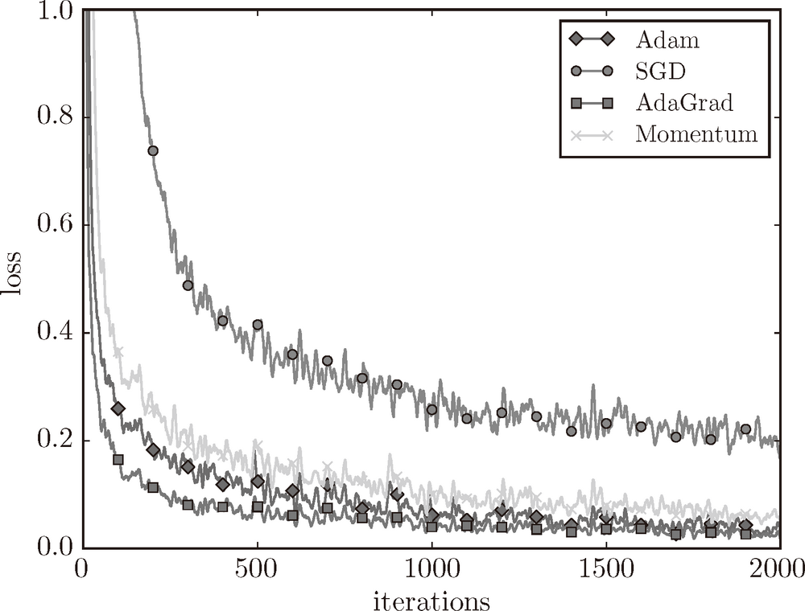

**图 6-9　基于 MNIST 数据集的 4 种更新方法的比较：横轴表示学习的迭代次数（iteration），纵轴表示损失函数的值（loss）**

这个实验以一个 5 层神经网络为对象，其中每层有 100 个神经元。激活函数使用的是 ReLU。

从图 6-9 的结果中可知，与 SGD 相比，其他 3 种方法学习得更快，而且速度基本相同，仔细看的话，AdaGrad 的学习进行得稍微快一点。这个实验需要注意的地方是，实验结果会随学习率等超参数、神经网络的结构（几层深等）的不同而发生变化。不过，一般而言，与 SGD 相比，其他 3 种方法可以学习得更快，有时最终的识别精度也更高。

### 6.2　权重的初始值

在神经网络的学习中，权重的初始值特别重要。实际上，设定什么样的权重初始值，经常关系到神经网络的学习能否成功。本节将介绍权重初始值的推荐值，并通过实验确认神经网络的学习是否会快速进行。

#### 6.2.1　可以将权重初始值设为 0 吗

后面我们会介绍抑制过拟合、提高泛化能力的技巧——权值衰减（weight decay）。简单地说，权值衰减就是一种以减小权重参数的值为目的进行学习的方法。通过减小权重参数的值来抑制过拟合的发生。

如果想减小权重的值，一开始就将初始值设为较小的值才是正途。实际上，在这之前的权重初始值都是像 `0.01 * np.random.randn(10, 100)` 这样，使用由高斯分布生成的值乘以 0.01 后得到的值（标准差为 0.01 的高斯分布）。

如果我们把权重初始值全部设为 0 以减小权重的值，会怎么样呢？从结论来说，将权重初始值设为 0 不是一个好主意。事实上，将权重初始值设为 0 的话，将无法正确进行学习。

为什么不能将权重初始值设为 0 呢？严格地说，为什么不能将权重初始值设成一样的值呢？这是因为在误差反向传播法中，所有的权重值都会进行相同的更新。比如，在 2 层神经网络中，假设第 1 层和第 2 层的权重为 0。这样一来，正向传播时，因为输入层的权重为 0，所以第 2 层的神经元全部会被传递相同的值。第 2 层的神经元中全部输入相同的值，这意味着反向传播时第 2 层的权重全部都会进行相同的更新（回忆一下“乘法节点的反向传播”的内容）。因此，权重被更新为相同的值，并拥有了对称的值（重复的值）。这使得神经网络拥有许多不同的权重的意义丧失了。为了防止“权重均一化”（严格地讲，是为了瓦解权重的对称结构），必须随机生成初始值。

#### 6.2.2　隐藏层的激活值的分布

观察隐藏层的激活值 {2[这里我们将激活函数的输出数据称为“激活值”，但是有的文献中会将在层之间流动的数据也称为“激活值”。]}（激活函数的输出数据）的分布，可以获得很多启发。这里，我们来做一个简单的实验，观察权重初始值是如何影响隐藏层的激活值的分布的。这里要做的实验是，向一个 5 层神经网络（激活函数使用 sigmoid 函数）传入随机生成的输入数据，用直方图绘制各层激活值的数据分布。这个实验参考了斯坦福大学的课程 CS231n [5]。

进行实验的源代码在 `ch06/weight_init_activation_histogram.py` 中，下面展示部分代码。

```
import numpy as np
import matplotlib.pyplot as plt

def sigmoid(x):
    return 1 / (1 + np.exp(-x))

x = np.random.randn(1000, 100) # 1000个数据
node_num = 100        # 各隐藏层的节点（神经元）数
hidden_layer_size = 5 # 隐藏层有5层
activations = {}      # 激活值的结果保存在这里

for i in range(hidden_layer_size):
    if i != 0:
        x = activations[i-1]

    w = np.random.randn(node_num, node_num) * 1

    z = np.dot(x, w)
    a = sigmoid(z)   # sigmoid函数
    activations[i] = a
```

这里假设神经网络有 5 层，每层有 100 个神经元。然后，用高斯分布随机生成 1000 个数据作为输入数据，并把它们传给 5 层神经网络。激活函数使用 sigmoid 函数，各层的激活值的结果保存在 `activations` 变量中。这个代码段中需要注意的是权重的尺度。虽然这次我们使用的是标准差为 1 的高斯分布，但实验的目的是通过改变这个尺度（标准差），观察激活值的分布如何变化。现在，我们将保存在 `activations` 中的各层数据画成直方图。

```
# 绘制直方图
for i, a in activations.items():
    plt.subplot(1, len(activations), i+1)
    plt.title(str(i+1) + "-layer")
    plt.hist(a.flatten(), 30, range=(0,1))
plt.show()
```

运行这段代码后，可以得到图 6-10 的直方图。

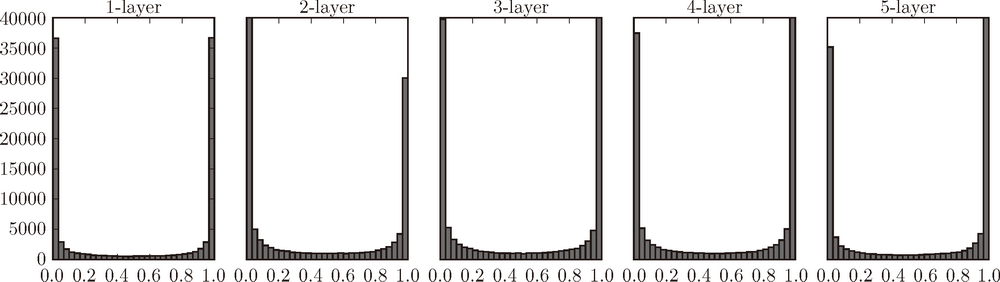

**图 6-10　使用标准差为 1 的高斯分布作为权重初始值时的各层激活值的分布**

从图 6-10 可知，各层的激活值呈偏向 0 和 1 的分布。这里使用的 sigmoid 函数是 S 型函数，随着输出不断地靠近 0（或者靠近 1），它的导数的值逐渐接近 0。因此，偏向 0 和 1 的数据分布会造成反向传播中梯度的值不断变小，最后消失。这个问题称为**梯度消失**（gradient vanishing）。层次加深的深度学习中，梯度消失的问题可能会更加严重。

下面，将权重的标准差设为 0.01，进行相同的实验。实验的代码只需要把设定权重初始值的地方换成下面的代码即可。

```
# w = np.random.randn(node_num, node_num) * 1
w = np.random.randn(node_num, node_num) * 0.01
```

来看一下结果。使用标准差为 0.01 的高斯分布时，各层的激活值的分布如图 6-11 所示。

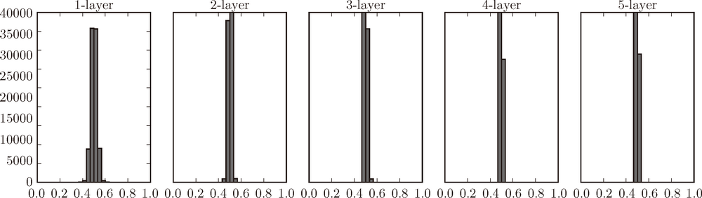

**图 6-11　使用标准差为 0.01 的高斯分布作为权重初始值时的各层激活值的分布**

这次呈集中在 0.5 附近的分布。因为不像刚才的例子那样偏向 0 和 1，所以不会发生梯度消失的问题。但是，激活值的分布有所偏向，说明在表现力上会有很大问题。为什么这么说呢？因为如果有多个神经元都输出几乎相同的值，那它们就没有存在的意义了。比如，如果 100 个神经元都输出几乎相同的值，那么也可以由 1 个神经元来表达基本相同的事情。因此，激活值在分布上有所偏向会出现“表现力受限”的问题。

> 各层的激活值的分布都要求有适当的广度。为什么呢？因为通过在各层间传递多样性的数据，神经网络可以进行高效的学习。反过来，如果传递的是有所偏向的数据，就会出现梯度消失或者“表现力受限”的问题，导致学习可能无法顺利进行。

接着，我们尝试使用 Xavier Glorot 等人的论文 [9] 中推荐的权重初始值（俗称“Xavier 初始值”）。现在，在一般的深度学习框架中，Xavier 初始值已被作为标准使用。比如，Caffe 框架中，通过在设定权重初始值时赋予 xavier 参数，就可以使用 Xavier 初始值。

Xavier 的论文中，为了使各层的激活值呈现出具有相同广度的分布，推导了合适的权重尺度。推导出的结论是，如果前一层的节点数为 *n*，则初始值使用标准差为 .latex) 的分布 {3[Xavier 的论文中提出的设定值，不仅考虑了前一层的输入节点数量，还考虑了下一层的输出节点数量。但是，Caffe 等框架的实现中进行了简化，只使用了这里所说的前一层的输入节点进行计算。]}（图 6-12）。

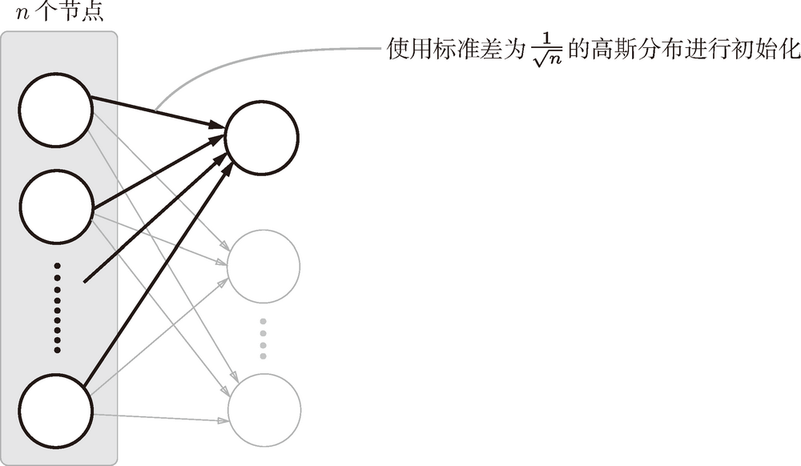

**图 6-12　Xavier 初始值：与前一层有 n 个节点连接时，初始值使用标准差为 .latex) 的分布**

使用 Xavier 初始值后，前一层的节点数越多，要设定为目标节点的初始值的权重尺度就越小。现在，我们使用 Xavier 初始值进行实验。进行实验的代码只需要将设定权重初始值的地方换成如下内容即可（因为此处所有层的节点数都是 100，所以简化了实现）。

```
node_num = 100 # 前一层的节点数
w = np.random.randn(node_num, node_num) / np.sqrt(node_num)
```

使用 Xavier 初始值后的结果如图 6-13 所示。从这个结果可知，越是后面的层，图像变得越歪斜，但是呈现了比之前更有广度的分布。因为各层间传递的数据有适当的广度，所以 sigmoid 函数的表现力不受限制，有望进行高效的学习。

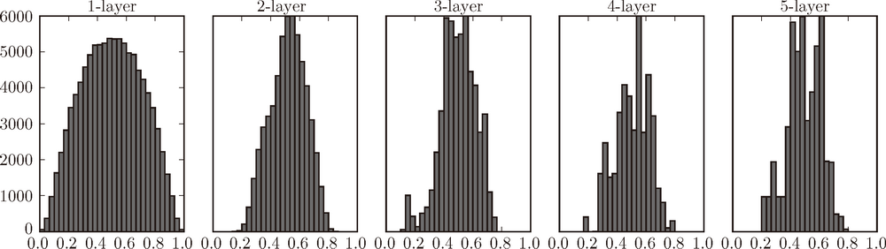

**图 6-13　使用 Xavier 初始值作为权重初始值时的各层激活值的分布**

> 图 6-13 的分布中，后面的层的分布呈稍微歪斜的形状。如果用 `tanh` 函数（双曲线函数）代替 `sigmoid` 函数，这个稍微歪斜的问题就能得到改善。实际上，使用 `tanh` 函数后，会呈漂亮的吊钟型分布。`tanh` 函数和 `sigmoid` 函数同是 S 型曲线函数，但 `tanh` 函数是关于原点 (0, 0) 对称的 S 型曲线，而 `sigmoid` 函数是关于 (*x*, *y*)=(0, 0.5) 对称的 S 型曲线。众所周知，用作激活函数的函数最好具有关于原点对称的性质。

#### 6.2.3　ReLU的权重初始值

Xavier 初始值是以激活函数是线性函数为前提而推导出来的。因为 `sigmoid` 函数和 `tanh` 函数左右对称，且中央附近可以视作线性函数，所以适合使用 Xavier 初始值。但当激活函数使用 ReLU 时，一般推荐使用 ReLU 专用的初始值，也就是 Kaiming He 等人推荐的初始值，也称为“He 初始值”[10]。当前一层的节点数为 *n* 时，He 初始值使用标准差为.latex) 的高斯分布。当 Xavier 初始值是 .latex) 时，（直观上）可以解释为，因为 ReLU 的负值区域的值为 0，为了使它更有广度，所以需要 2 倍的系数。

现在来看一下激活函数使用 ReLU 时激活值的分布。我们给出了 3 个实验的结果（图 6-14），依次是权重初始值为标准差是 0.01 的高斯分布（下文简写为“std = 0.01”）时、初始值为 Xavier 初始值时、初始值为 ReLU 专用的“He 初始值”时的结果。

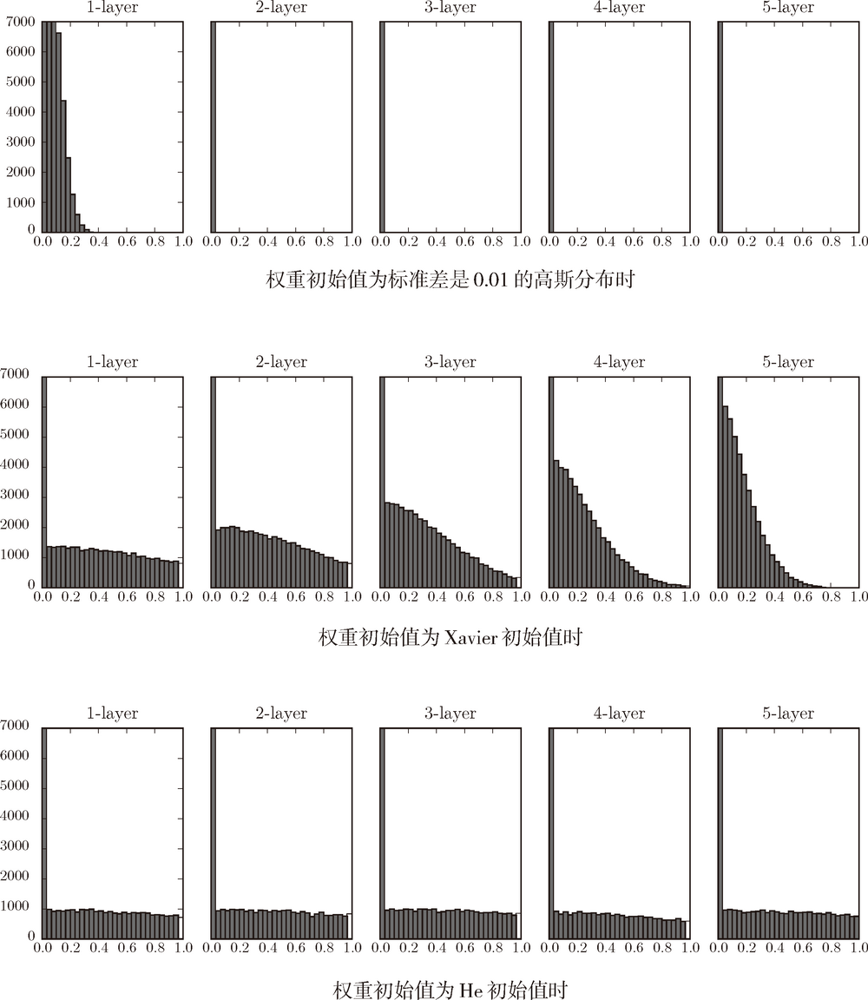

**图 6-14　激活函数使用 ReLU 时，不同权重初始值的激活值分布的变化**

观察实验结果可知，当“std = 0.01”时，各层的激活值非常小 {4[各层激活值的分布平均值如下。1 层 : 0.0396，2 层 : 0.00290，3 层 : 0.000197，4 层 : 1.32e-5，5 层 : 9.46e-7。]}。神经网络上传递的是非常小的值，说明逆向传播时权重的梯度也同样很小。这是很严重的问题，实际上学习基本上没有进展。

接下来是初始值为 Xavier 初始值时的结果。在这种情况下，随着层的加深，偏向一点点变大。实际上，层加深后，激活值的偏向变大，学习时会出现梯度消失的问题。而当初始值为 He 初始值时，各层中分布的广度相同。由于即便层加深，数据的广度也能保持不变，因此逆向传播时，也会传递合适的值。

总结一下，当激活函数使用 ReLU 时，权重初始值使用 He 初始值，当激活函数为 `sigmoid` 或 `tanh`等 S 型曲线函数时，初始值使用 Xavier 初始值。这是目前的最佳实践。

#### 6.2.4　基于 MNIST 数据集的权重初始值的比较

下面通过实际的数据，观察不同的权重初始值的赋值方法会在多大程度上影响神经网络的学习。这里，我们基于 std = 0.01、Xavier 初始值、He 初始值进行实验（源代码在 `ch06/weight_init_compare.py` 中）。先来看一下结果，如图 6-15 所示。


**图 6-15　基于 MNIST 数据集的权重初始值的比较：横轴是学习的迭代次数（iterations），纵轴是损失函数的值（loss）**

这个实验中，神经网络有 5 层，每层有 100 个神经元，激活函数使用的是 ReLU。从图 6-15 的结果可知，std = 0.01 时完全无法进行学习。这和刚才观察到的激活值的分布一样，是因为正向传播中传递的值很小（集中在 0 附近的数据）。因此，逆向传播时求到的梯度也很小，权重几乎不进行更新。相反，当权重初始值为 Xavier 初始值和 He 初始值时，学习进行得很顺利。并且，我们发现 He 初始值时的学习进度更快一些。

综上，在神经网络的学习中，权重初始值非常重要。很多时候权重初始值的设定关系到神经网络的学习能否成功。权重初始值的重要性容易被忽视，而任何事情的开始（初始值）总是关键的，因此在结束本节之际，再次强调一下权重初始值的重要性。

### 6.3　Batch Normalization

在上一节，我们观察了各层的激活值分布，并从中了解到如果设定了合适的权重初始值，则各层的激活值分布会有适当的广度，从而可以顺利地进行学习。那么，为了使各层拥有适当的广度，“强制性”地调整激活值的分布会怎样呢？实际上，Batch Normalization[11] 方法就是基于这个想法而产生的。

#### 6.3.1　Batch Normalization 的算法

Batch Normalization（下文简称 Batch Norm）是 2015 年提出的方法。Batch Norm 虽然是一个问世不久的新方法，但已经被很多研究人员和技术人员广泛使用。实际上，看一下机器学习竞赛的结果，就会发现很多通过使用这个方法而获得优异结果的例子。

为什么 Batch Norm 这么惹人注目呢？因为 Batch Norm 有以下优点。

> - 可以使学习快速进行（可以增大学习率）。
> - 不那么依赖初始值（对于初始值不用那么神经质）。
> - 抑制过拟合（降低 Dropout 等的必要性）。

考虑到深度学习要花费很多时间，第一个优点令人非常开心。另外，后两点也可以帮我们消除深度学习的学习中的很多烦恼。

如前所述，Batch Norm 的思路是调整各层的激活值分布使其拥有适当的广度。为此，要向神经网络中插入对数据分布进行正规化的层，即 Batch Normalization 层（下文简称 Batch Norm 层），如图 6-16 所示。

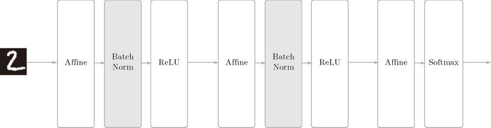

**图 6-16　使用了 Batch Normalization 的神经网络的例子（Batch Norm 层的背景为灰色）**

Batch Norm，顾名思义，以进行学习时的 mini-batch 为单位，按 mini-batch 进行正规化。具体而言，就是进行使数据分布的均值为 0、方差为 1 的正规化。用数学式表示的话，如下所示。

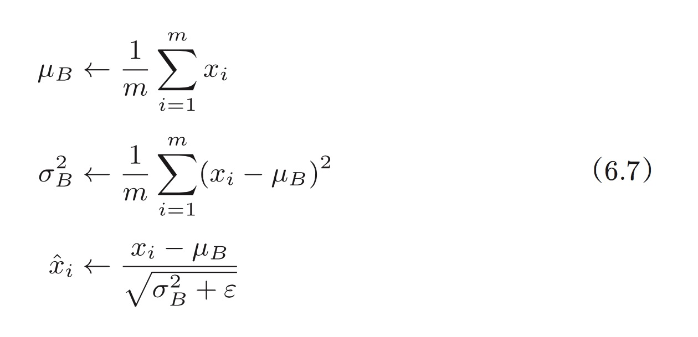

这里对 mini-batch 的 *m* 个输入数据的集合 *B*={*x*1, *x*2···, *x*m}求均值 .latex) 和方差 .latex)。然后，对输入数据进行均值为 0、方差为 1（合适的分布）的正规化。式（6.7）中的 *ε* 是一个微小值（比如，`10e-7`等），它是为了防止出现除以 0 的情况。

式（6.7）所做的是将 mini-batch 的输入数据{*x*1, *x*2···, *x*m}变换为均值为 0、方差为 1 的数据 .latex)，非常简单。通过将这个处理插入到激活函数的前面（或者后面）{5[文献 [11]、文献 [12] 等中有讨论（做过实验）应该把 Batch Normalization 插入到激活函数的前面还是后面。]}，可以减小数据分布的偏向。

接着，Batch Norm 层会对正规化后的数据进行缩放和平移的变换，用数学式可以如下表示。

.latex)

这里，*γ* 和 *β* 是参数。一开始 *γ* = 1，*β* = 0，然后再通过学习调整到合适的值。

上面就是 Batch Norm 的算法。这个算法是神经网络上的正向传播。如果使用第 5 章介绍的计算图，Batch Norm 可以表示为图 6-17。

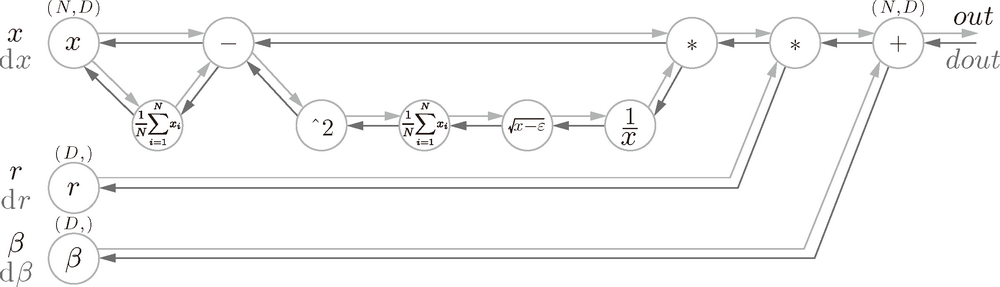

**图 6-17　Batch Normalization 的计算图（引用自文献 [13]）**

Batch Norm 的反向传播的推导有些复杂，这里我们不进行介绍。不过如果使用图 6-17 的计算图来思考的话，Batch Norm 的反向传播或许也能比较轻松地推导出来。Frederik Kratzert 的博客“Understanding the backward pass through Batch Normalization Layer”[13] 里有详细说明，感兴趣的读者可以参考一下。

#### 6.3.2　Batch Normalization的评估

现在我们使用 Batch Norm 层进行实验。首先，使用 MNIST 数据集，观察使用Batch Norm 层和不使用 Batch Norm 层时学习的过程会如何变化（源代码在 `ch06/batch_norm_test.py` 中），结果如图 6-18 所示。

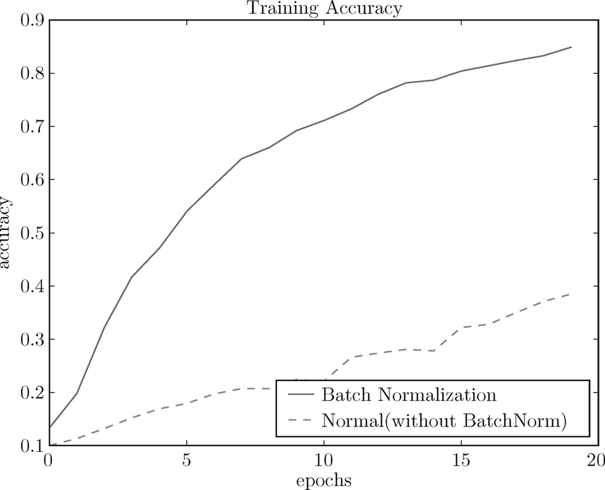

**图 6-18　基于 Batch Norm 的效果：使用 Batch Norm 后，学习进行得更快了**

从图 6-18 的结果可知，使用 Batch Norm 后，学习进行得更快了。接着，给予不同的初始值尺度，观察学习的过程如何变化。图 6-19 是权重初始值的标准差为各种不同的值时的学习过程图。

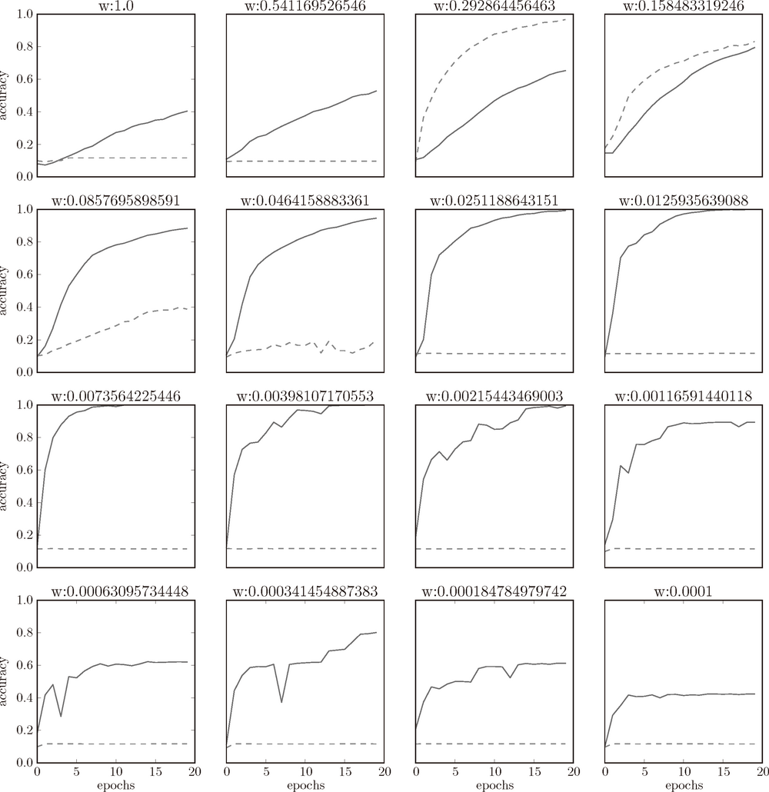

**图 6-19　图中的实线是使用了 Batch Norm 时的结果，虚线是没有使用 Batch Norm 时的结果：图的标题处标明了权重初始值的标准差**

我们发现，几乎所有的情况下都是使用 Batch Norm 时学习进行得更快。同时也可以发现，实际上，在不使用 Batch Norm 的情况下，如果不赋予一个尺度好的初始值，学习将完全无法进行。

综上，通过使用 Batch Norm，可以推动学习的进行。并且，对权重初始值变得健壮（“对初始值健壮”表示不那么依赖初始值）。Batch Norm 具备了如此优良的性质，一定能应用在更多场合中。

### 6.4　正则化

机器学习的问题中，**过拟合**是一个很常见的问题。过拟合指的是只能拟合训练数据，但不能很好地拟合不包含在训练数据中的其他数据的状态。机器学习的目标是提高泛化能力，即便是没有包含在训练数据里的未观测数据，也希望模型可以进行正确的识别。我们可以制作复杂的、表现力强的模型，但是相应地，抑制过拟合的技巧也很重要。

#### 6.4.1　过拟合

发生过拟合的原因，主要有以下两个。

> - 模型拥有大量参数、表现力强。
> - 训练数据少。

这里，我们故意满足这两个条件，制造过拟合现象。为此，要从 MNIST 数据集原本的 60000 个训练数据中只选定 300 个，并且，为了增加网络的复杂度，使用 7 层网络（每层有 100 个神经元，激活函数为 ReLU）。

下面是用于实验的部分代码（对应文件在 `ch06/overfit_weight_decay.py` 中）。首先是用于读入数据的代码。

```
(x_train, t_train), (x_test, t_test) = load_mnist(normalize=True)
# 为了再现过拟合，减少学习数据
x_train = x_train[:300]
t_train = t_train[:300]
```

接着是进行训练的代码。和之前的代码一样，按 epoch 分别算出所有训练数据和所有测试数据的识别精度。

```
network = MultiLayerNet(input_size=784, hidden_size_list=[100, 100, 100,
100, 100, 100], output_size=10)
optimizer = SGD(lr=0.01) # 用学习率为0.01的SGD更新参数

max_epochs = 201
train_size = x_train.shape[0]
batch_size = 100

train_loss_list = []
train_acc_list = []
test_acc_list = []

iter_per_epoch = max(train_size / batch_size, 1)
epoch_cnt = 0

for i in range(1000000000):
    batch_mask = np.random.choice(train_size, batch_size)

    x_batch = x_train[batch_mask]
    t_batch = t_train[batch_mask]

    grads = network.gradient(x_batch, t_batch)
    optimizer.update(network.params, grads)

    if i % iter_per_epoch == 0:
        train_acc = network.accuracy(x_train, t_train)
        test_acc = network.accuracy(x_test, t_test)
        train_acc_list.append(train_acc)
        test_acc_list.append(test_acc)

        epoch_cnt += 1
        if epoch_cnt >= max_epochs:
            break
```

`train_acc_list` 和 `test_acc_list` 中以 epoch 为单位（看完了所有训练数据的单位）保存识别精度。现在，我们将这些列表（`train_acc_list`、`test_acc_list`）绘成图，结果如图 6-20 所示。

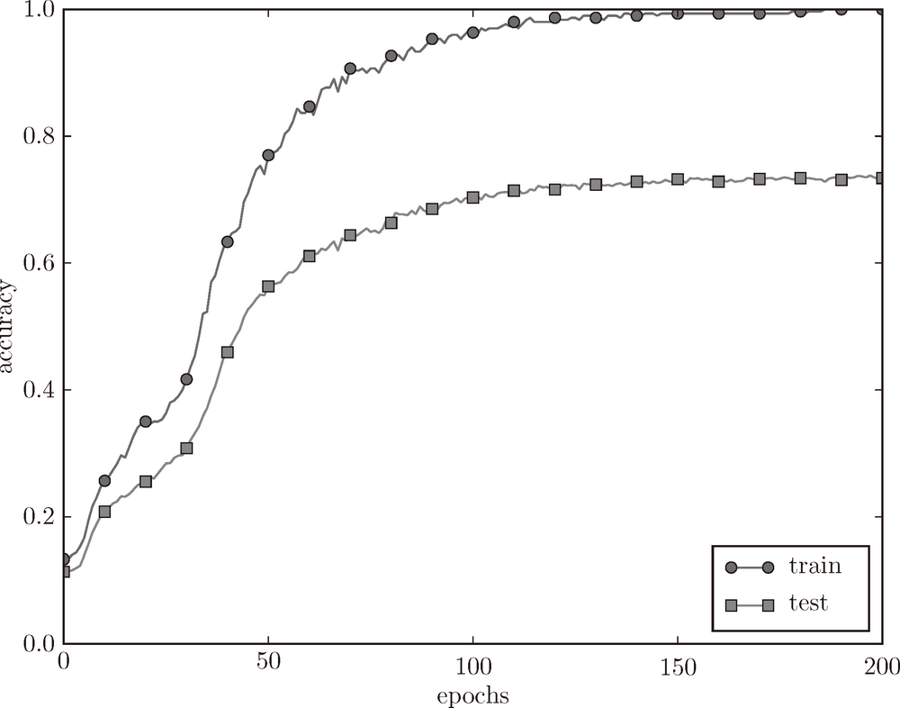

**图 6-20　训练数据（train）和测试数据（test）的识别精度的变化**

过了 100 个 epoch 左右后，用训练数据测量到的识别精度几乎都为 100%。但是，对于测试数据，离 100% 的识别精度还有较大的差距。如此大的识别精度差距，是只拟合了训练数据的结果。从图中可知，模型对训练时没有使用的一般数据（测试数据）拟合得不是很好。

#### 6.4.2　权值衰减

**权值衰减**是一直以来经常被使用的一种抑制过拟合的方法。该方法通过在学习的过程中对大的权重进行惩罚，来抑制过拟合。很多过拟合原本就是因为权重参数取值过大才发生的。

复习一下，神经网络的学习目的是减小损失函数的值。这时，例如为损失函数加上权重的平方范数（L2 范数）。这样一来，就可以抑制权重变大。用符号表示的话，如果将权重记为 **W**，L2 范数的权值衰减就是 .latex)，然后将这个 .latex) 加到损失函数上。这里，*λ* 是控制正则化强度的超参数。*λ* 设置得越大，对大的权重施加的惩罚就越重。此外，.latex) 开头的 .latex) 是用于将 .latex) 的求导结果变成 .latex) 的调整用常量。

对于所有权重，权值衰减方法都会为损失函数加上 .latex)。因此，在求权重梯度的计算中，要为之前的误差反向传播法的结果加上正则化项的导数 .latex)。

> L2 范数相当于各个元素的平方和。用数学式表示的话，假设有权重 **W**=(*w*1, *w*2,···,*w*n)，则 L2 范数可用 .latex) 计算出来。除了 L2 范数，还有 L1 范数、L ∞范数等。L1 范数是各个元素的绝对值之和，相当于 |*w*1| + |*w*2| +···+ |*w*n|。L∞范数也称为 Max 范数，相当于各个元素的绝对值中最大的那一个。L2 范数、L1 范数、L∞范数都可以用作正则化项，它们各有各的特点，不过这里我们要实现的是比较常用的 L2 范数。

现在我们来进行实验。对于刚刚进行的实验，应用 *λ* = 0.1 的权值衰减，结果如图 6-21 所示（对应权值衰减的网络在 `common/multi_layer_net.py` 中，用于实验的代码在 `ch06/overfit_weight_decay.py` 中）。

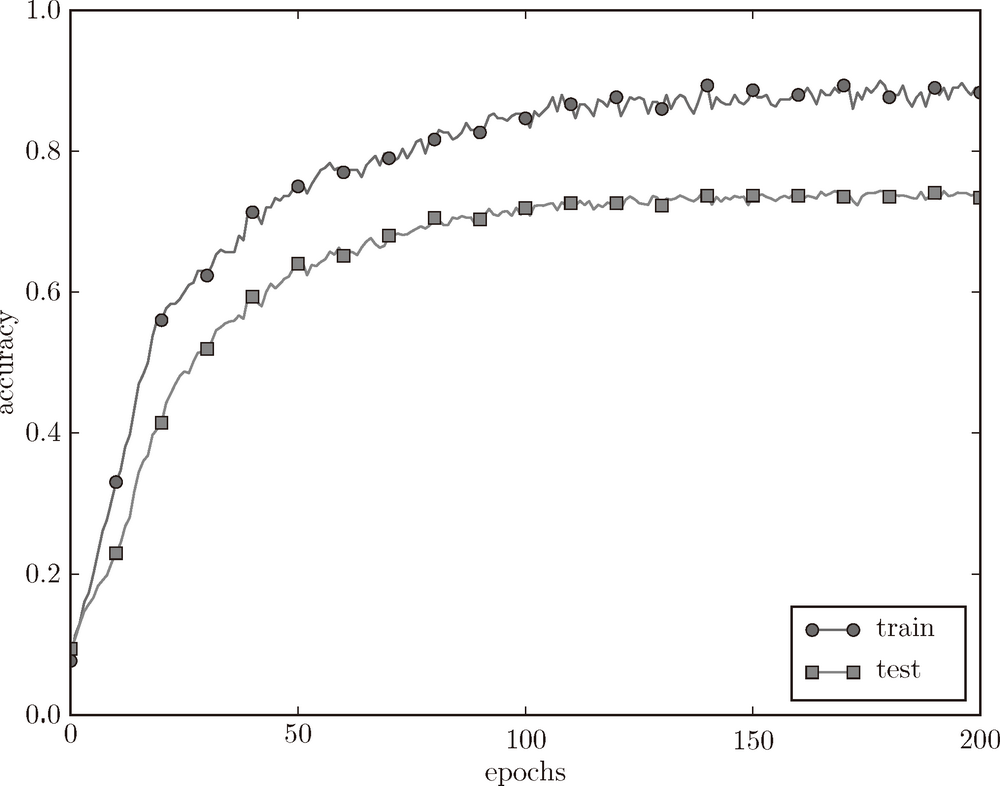

**图 6-21　使用了权值衰减的训练数据（**train**）和测试数据（**test**）的识别精度的变化**

如图 6-21 所示，虽然训练数据的识别精度和测试数据的识别精度之间有差距，但是与没有使用权值衰减的图 6-20 的结果相比，差距变小了。这说明过拟合受到了抑制。此外，还要注意，训练数据的识别精度没有达到 100%（1.0）。

#### 6.4.3　Dropout

作为抑制过拟合的方法，前面我们介绍了为损失函数加上权重的 L2 范数的权值衰减方法。该方法可以简单地实现，在某种程度上能够抑制过拟合。但是，如果网络的模型变得很复杂，只用权值衰减就难以应对了。在这种情况下，我们经常会使用 Dropout [14] 方法。

Dropout 是一种在学习的过程中随机删除神经元的方法。训练时，随机选出隐藏层的神经元，然后将其删除。被删除的神经元不再进行信号的传递，如图 6-22 所示。训练时，每传递一次数据，就会随机选择要删除的神经元。然后，测试时，虽然会传递所有的神经元信号，但是对于各个神经元的输出，要乘上训练时的删除比例后再输出。

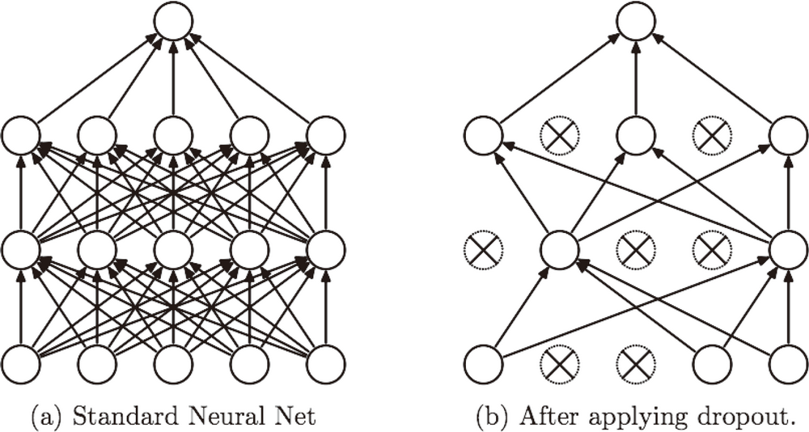

**图 6-22　Dropout 的概念图（引用自文献 [14]）：左边是一般的神经网络，右边是应用了 Dropout 的网络。Dropout 通过随机选择并删除神经元，停止向前传递信号**

下面我们来实现 Dropout。这里的实现重视易理解性。不过，因为训练时如果进行恰当的计算的话，正向传播时单纯地传递数据就可以了（不用乘以删除比例），所以深度学习的框架中进行了这样的实现。关于高效的实现，可以参考 Chainer 中实现的 Dropout。

```
class Dropout:
    def __init__(self, dropout_ratio=0.5):
        self.dropout_ratio = dropout_ratio
        self.mask = None

    def forward(self, x, train_flg=True):
        if train_flg:
            self.mask = np.random.rand(*x.shape) > self.dropout_ratio
            return x * self.mask
        else:
            return x * (1.0 - self.dropout_ratio)

    def backward(self, dout):
        return dout * self.mask
```

这里的要点是，每次正向传播时，`self.mask` 中都会以 `False` 的形式保存要删除的神经元。`self.mask` 会随机生成和 `x` 形状相同的数组，并将值比 `dropout_ratio` 大的元素设为 `True`。反向传播时的行为和 ReLU 相同。也就是说，正向传播时传递了信号的神经元，反向传播时按原样传递信号；正向传播时没有传递信号的神经元，反向传播时信号将停在那里。

现在，我们使用 MNIST 数据集进行验证，以确认 Dropout 的效果。源代码在 `ch06/overfit_dropout.py` 中。另外，源代码中使用了 `Trainer` 类来简化实现。

> `common/trainer.py` 中实现了 `Trainer` 类。这个类可以负责前面所进行的网络的学习。详细内容可以参照 `common/trainer.py` 和 `ch06/overfit_dropout.py`。

Dropout 的实验和前面的实验一样，使用 7 层网络（每层有 100 个神经元，激活函数为 ReLU），一个使用 Dropout，另一个不使用 Dropout，实验的结果如图 6-23 所示。

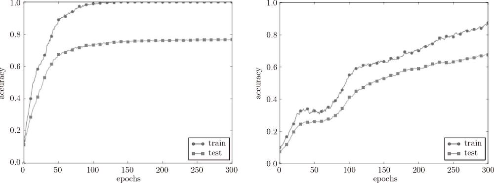

**图 6-23　左边没有使用 Dropout，右边使用了 Dropout（dropout_rate=0.15）**

图 6-23 中，通过使用 Dropout，训练数据和测试数据的识别精度的差距变小了。并且，训练数据也没有到达 100% 的识别精度。像这样，通过使用 Dropout，即便是表现力强的网络，也可以抑制过拟合。

> 机器学习中经常使用集成学习。所谓集成学习，就是让多个模型单独进行学习，推理时再取多个模型的输出的平均值。用神经网络的语境来说，比如，准备 5 个结构相同（或者类似）的网络，分别进行学习，测试时，以这 5 个网络的输出的平均值作为答案。实验告诉我们，通过进行集成学习，神经网络的识别精度可以提高好几个百分点。这个集成学习与 Dropout 有密切的关系。这是因为可以将 Dropout 理解为，通过在学习过程中随机删除神经元，从而每一次都让不同的模型进行学习。并且，推理时，通过对神经元的输出乘以删除比例（比如，0.5 等），可以取得模型的平均值。也就是说，可以理解成，Dropout将集成学习的效果（模拟地）通过一个网络实现了。

### 6.5　超参数的验证

神经网络中，除了权重和偏置等参数，**超参数**（hyper-parameter）也经常出现。这里所说的超参数是指，比如各层的神经元数量、batch 大小、参数更新时的学习率或权值衰减等。如果这些超参数没有设置合适的值，模型的性能就会很差。虽然超参数的取值非常重要，但是在决定超参数的过程中一般会伴随很多的试错。本节将介绍尽可能高效地寻找超参数的值的方法。

#### 6.5.1　验证数据

之前我们使用的数据集分成了训练数据和测试数据，训练数据用于学习，测试数据用于评估泛化能力。由此，就可以评估是否只过度拟合了训练数据（是否发生了过拟合），以及泛化能力如何等。

下面我们要对超参数设置各种各样的值以进行验证。这里要注意的是，不能使用测试数据评估超参数的性能。这一点非常重要，但也容易被忽视。

为什么不能用测试数据评估超参数的性能呢？这是因为如果使用测试数据调整超参数，超参数的值会对测试数据发生过拟合。换句话说，用测试数据确认超参数的值的“好坏”，就会导致超参数的值被调整为只拟合测试数据。这样的话，可能就会得到不能拟合其他数据、泛化能力低的模型。

因此，调整超参数时，必须使用超参数专用的确认数据。用于调整超参数的数据，一般称为**验证数据**（validation data）。我们使用这个验证数据来评估超参数的好坏。

> 训练数据用于参数（权重和偏置）的学习，验证数据用于超参数的性能评估。为了确认泛化能力，要在最后使用（比较理想的是只用一次）测试数据。

根据不同的数据集，有的会事先分成训练数据、验证数据、测试数据三部分，有的只分成训练数据和测试数据两部分，有的则不进行分割。在这种情况下，用户需要自行进行分割。如果是 MNIST 数据集，获得验证数据的最简单的方法就是从训练数据中事先分割 20% 作为验证数据，代码如下所示。

```
(x_train, t_train), (x_test, t_test) = load_mnist()

# 打乱训练数据
x_train, t_train = shuffle_dataset(x_train, t_train)

# 分割验证数据
validation_rate = 0.20
validation_num = int(x_train.shape[0] * validation_rate)

x_val = x_train[:validation_num]
t_val = t_train[:validation_num]
x_train = x_train[validation_num:]
t_train = t_train[validation_num:]
```

这里，分割训练数据前，先打乱了输入数据和教师标签。这是因为数据集的数据可能存在偏向（比如，数据从“0”到“10”按顺序排列等）。这里使用的 `shuffle_dataset` 函数利用了 `np.random.shuffle`，在 `common/util.py` 中有它的实现。

接下来，我们使用验证数据观察超参数的最优化方法。

#### 6.5.2　超参数的最优化

进行超参数的最优化时，逐渐缩小超参数的“好值”的存在范围非常重要。所谓逐渐缩小范围，是指一开始先大致设定一个范围，从这个范围中随机选出一个超参数（采样），用这个采样到的值进行识别精度的评估；然后，多次重复该操作，观察识别精度的结果，根据这个结果缩小超参数的“好值”的范围。通过重复这一操作，就可以逐渐确定超参数的合适范围。

> 有报告 [15] 显示，在进行神经网络的超参数的最优化时，与网格搜索等有规律的搜索相比，随机采样的搜索方式效果更好。这是因为在多个超参数中，各个超参数对最终的识别精度的影响程度不同。

超参数的范围只要“大致地指定”就可以了。所谓“大致地指定”，是指像 0.001（10-3）到 1000（103）这样，以“10 的阶乘”的尺度指定范围（也表述为“用对数尺度（log scale）指定”）。

在超参数的最优化中，要注意的是深度学习需要很长时间（比如，几天或几周）。因此，在超参数的搜索中，需要尽早放弃那些不符合逻辑的超参数。于是，在超参数的最优化中，减少学习的 epoch，缩短一次评估所需的时间是一个不错的办法。

以上就是超参数的最优化的内容，简单归纳一下，如下所示。

> **步骤 0**
>
> 设定超参数的范围。
>
> **步骤 1**
>
> 从设定的超参数范围中随机采样。
>
> **步骤 2**
>
> 使用步骤 1 中采样到的超参数的值进行学习，通过验证数据评估识别精度（但是要将 epoch 设置得很小）。
>
> **步骤 3**
>
> 重复步骤 1 和步骤 2（100 次等），根据它们的识别精度的结果，缩小超参数的范围。

反复进行上述操作，不断缩小超参数的范围，在缩小到一定程度时，从该范围中选出一个超参数的值。这就是进行超参数的最优化的一种方法。

> 这里介绍的超参数的最优化方法是实践性的方法。不过，这个方法与其说是科学方法，倒不如说有些实践者的经验的感觉。在超参数的最优化中，如果需要更精炼的方法，可以使用**贝叶斯最优化**（Bayesian optimization）。贝叶斯最优化运用以贝叶斯定理为中心的数学理论，能够更加严密、高效地进行最优化。详细内容请参考论文“Practical Bayesian Optimization of Machine Learning Algorithms”[16] 等。

#### 6.5.3　超参数最优化的实现

现在，我们使用 MNIST 数据集进行超参数的最优化。这里我们将学习率和控制权值衰减强度的系数（下文称为“权值衰减系数”）这两个超参数的搜索问题作为对象。这个问题的设定和解决思路参考了斯坦福大学的课程“CS231n”。

如前所述，通过从 0.001（10-3）到 1000（103）这样的对数尺度的范围中随机采样进行超参数的验证。这在 Python 中可以写成 `10 ** np.random.uniform(-3, 3)`。在该实验中，权值衰减系数的初始范围为 10-8 到 10-4，学习率的初始范围为 10-6 到 10-2。此时，超参数的随机采样的代码如下所示。

```
weight_decay = 10 ** np.random.uniform(-8, -4)
lr = 10 ** np.random.uniform(-6, -2)
```

像这样进行随机采样后，再使用那些值进行学习。之后，多次使用各种超参数的值重复进行学习，观察合乎逻辑的超参数在哪里。这里省略了具体实现，只列出了结果。进行超参数最优化的源代码在 `ch06/hyperparameter_optimization.py` 中，请大家自由参考。

下面我们就以权值衰减系数为 10-8 到 10-4、学习率为 10-6 到 10-2 的范围进行实验，结果如图 6-24 所示。

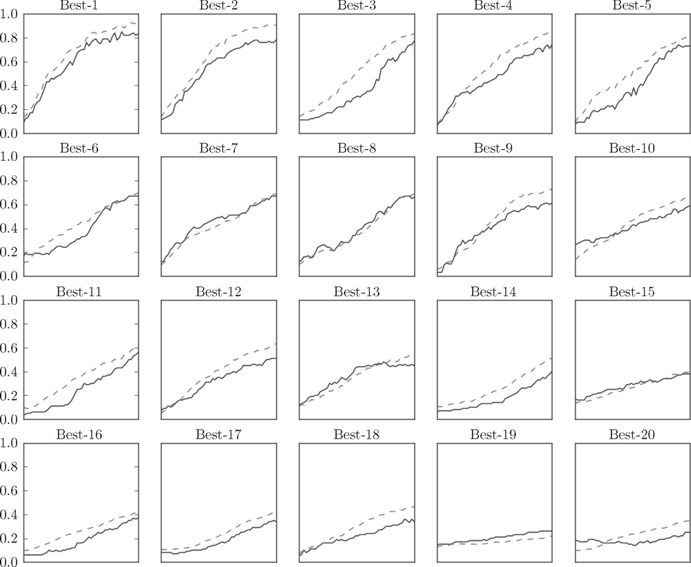

**图 6-24　实线是验证数据的识别精度，虚线是训练数据的识别精度**

图 6-24 中，按识别精度从高到低的顺序排列了验证数据的学习的变化。从图中可知，直到“Best-5”左右，学习进行得都很顺利。因此，我们来观察一下“Best-5”之前的超参数的值（学习率和权值衰减系数），结果如下所示。

```
Best-1 (val acc:0.83) | lr:0.0092, weight decay:3.86e-07
Best-2 (val acc:0.78) | lr:0.00956, weight decay:6.04e-07
Best-3 (val acc:0.77) | lr:0.00571, weight decay:1.27e-06
Best-4 (val acc:0.74) | lr:0.00626, weight decay:1.43e-05
Best-5 (val acc:0.73) | lr:0.0052, weight decay:8.97e-06
```

从这个结果可以看出，学习率在 0.001 到 0.01、权值衰减系数在 10-8 到 10-6 之间时，学习可以顺利进行。像这样，观察可以使学习顺利进行的超参数的范围，从而缩小值的范围。然后，在这个缩小的范围中重复相同的操作。这样就能缩小到合适的超参数的存在范围，然后在某个阶段，选择一个最终的超参数的值。