第7章 卷积神经网络


本章的主题是卷积神经网络（Convolutional Neural Network，**CNN**）。CNN 被用于图像识别、语音识别等各种场合，在图像识别的比赛中，基于深度学习的方法几乎都以 CNN 为基础。本章将详细介绍 CNN 的结构，并用 Python 实现其处理内容。

### 7.1　整体结构

首先，来看一下 CNN 的网络结构，了解 CNN 的大致框架。CNN 和之前介绍的神经网络一样，可以像乐高积木一样通过组装层来构建。不过，CNN 中新出现了卷积层（Convolution 层）和池化层（Pooling 层）。卷积层和池化层将在下一节详细介绍，这里我们先看一下如何组装层以构建 CNN。

之前介绍的神经网络中，相邻层的所有神经元之间都有连接，这称为**全连接**（fully-connected）。另外，我们用 Affine 层实现了全连接层。如果使用这个 Affine 层，一个 5 层的全连接的神经网络就可以通过图 7-1 所示的网络结构来实现。

如图 7-1 所示，全连接的神经网络中，Affine 层后面跟着激活函数 ReLU 层（或者 Sigmoid 层）。这里堆叠了 4 层“Affine-ReLU”组合，然后第 5 层是 Affine 层，最后由 Softmax 层输出最终结果（概率）。

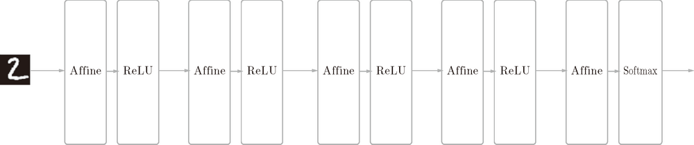

**图 7-1　基于全连接层（Affine 层）的网络的例子**

那么，CNN 会是什么样的结构呢？图 7-2 是 CNN 的一个例子。


**图 7-2　基于 CNN 的网络的例子：新增了 Convolution 层和 Pooling 层（用灰色的方块表示）**

如图 7-2 所示，CNN 中新增了 Convolution 层和 Pooling 层。CNN 的层的连接顺序是“Convolution - ReLU -（Pooling）”（Pooling 层有时会被省略）。这可以理解为之前的“Affine - ReLU”连接被替换成了“Convolution - ReLU -（Pooling）”连接。

还需要注意的是，在图 7-2 的 CNN 中，靠近输出的层中使用了之前的“Affine - ReLU”组合。此外，最后的输出层中使用了之前的“Affine - Softmax”组合。这些都是一般的 CNN 中比较常见的结构。

### 7.2　卷积层

CNN 中出现了一些特有的术语，比如填充、步幅等。此外，各层中传递的数据是有形状的数据（比如，3 维数据），这与之前的全连接网络不同，因此刚开始学习 CNN 时可能会感到难以理解。本节我们将花点时间，认真学习一下 CNN 中使用的卷积层的结构。

#### 7.2.1　全连接层存在的问题

之前介绍的全连接的神经网络中使用了全连接层（Affine 层）。在全连接层中，相邻层的神经元全部连接在一起，输出的数量可以任意决定。

全连接层存在什么问题呢？那就是数据的形状被“忽视”了。比如，输入数据是图像时，图像通常是高、长、通道方向上的 3 维形状。但是，向全连接层输入时，需要将 3 维数据拉平为 1 维数据。实际上，前面提到的使用了 MNIST 数据集的例子中，输入图像就是 1 通道、高 28 像素、长 28 像素的（1, 28, 28）形状，但却被排成 1 列，以 784 个数据的形式输入到最开始的 Affine 层。

图像是 3 维形状，这个形状中应该含有重要的空间信息。比如，空间上邻近的像素为相似的值、RBG 的各个通道之间分别有密切的关联性、相距较远的像素之间没有什么关联等，3 维形状中可能隐藏有值得提取的本质模式。但是，因为全连接层会忽视形状，将全部的输入数据作为相同的神经元（同一维度的神经元）处理，所以无法利用与形状相关的信息。

而卷积层可以保持形状不变。当输入数据是图像时，卷积层会以 3 维数据的形式接收输入数据，并同样以 3 维数据的形式输出至下一层。因此，在 CNN 中，可以（有可能）正确理解图像等具有形状的数据。

另外，CNN 中，有时将卷积层的输入输出数据称为**特征图**（feature map）。其中，卷积层的输入数据称为**输入特征图**（input feature map），输出数据称为**输出特征图**（output feature map）。中将“输入输出数据”和“特征图”作为含义相同的词使用。

#### 7.2.2　卷积运算

卷积层进行的处理就是卷积运算。卷积运算相当于图像处理中的“滤波器运算”。在介绍卷积运算时，我们来看一个具体的例子（图 7-3）。


**图 7-3　卷积运算的例子：用“”符号表示卷积运算**

如图 7-3 所示，卷积运算对输入数据应用滤波器。在这个例子中，输入数据是有高长方向的形状的数据，滤波器也一样，有高长方向上的维度。假设用（height, width）表示数据和滤波器的形状，则在本例中，输入大小是 (4, 4)，滤波器大小是 (3, 3)，输出大小是 (2, 2)。另外，有的文献中也会用“核”这个词来表示这里所说的“滤波器”。

现在来解释一下图 7-3 的卷积运算的例子中都进行了什么样的计算。图 7-4 中展示了卷积运算的计算顺序。

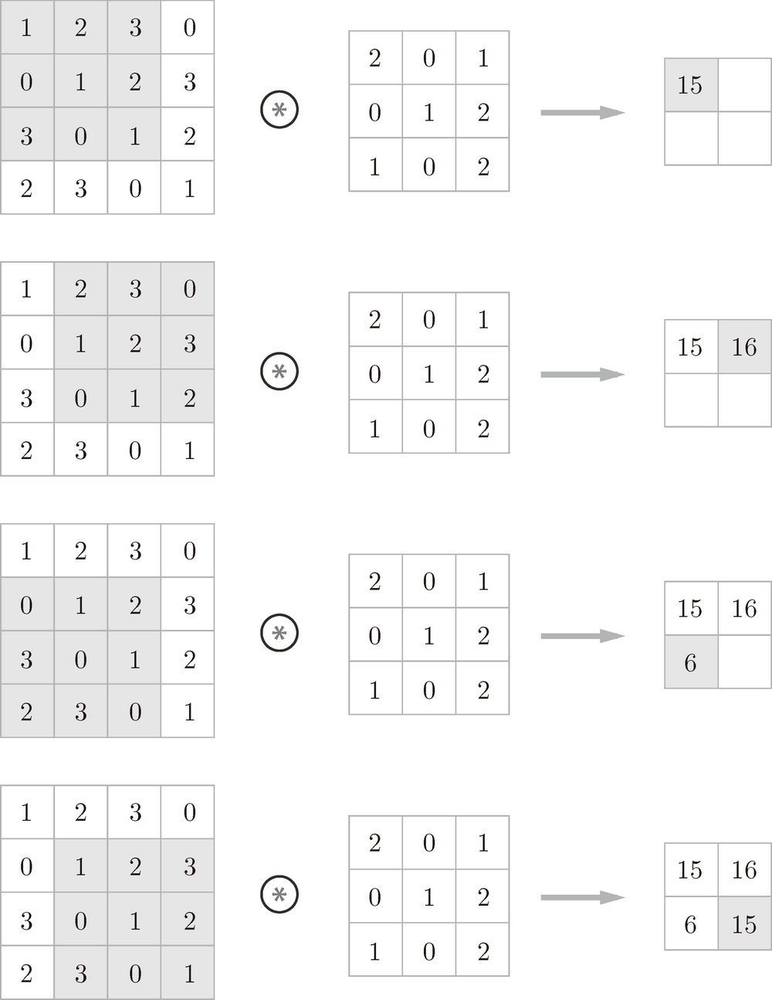

**图 7-4　卷积运算的计算顺序**

对于输入数据，卷积运算以一定间隔滑动滤波器的窗口并应用。这里所说的窗口是指图 7-4 中灰色的 3 × 3 的部分。如图 7-4 所示，将各个位置上滤波器的元素和输入的对应元素相乘，然后再求和（有时将这个计算称为**乘积累加运算**）。然后，将这个结果保存到输出的对应位置。将这个过程在所有位置都进行一遍，就可以得到卷积运算的输出。

在全连接的神经网络中，除了权重参数，还存在偏置。CNN 中，滤波器的参数就对应之前的权重。并且，CNN 中也存在偏置。图 7-3 的卷积运算的例子一直展示到了应用滤波器的阶段。包含偏置的卷积运算的处理流如图 7-5 所示。

如图 7-5 所示，向应用了滤波器的数据加上了偏置。偏置通常只有 1 个（1 × 1）（本例中，相对于应用了滤波器的 4 个数据，偏置只有 1 个），这个值会被加到应用了滤波器的所有元素上。

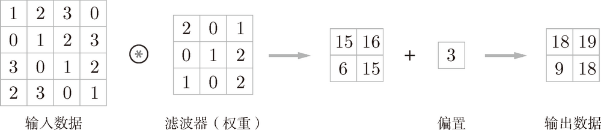

**图 7-5　卷积运算的偏置：向应用了滤波器的元素加上某个固定值（偏置）**

#### 7.2.3　填充

在进行卷积层的处理之前，有时要向输入数据的周围填入固定的数据（比如 0 等），这称为**填充**（padding），是卷积运算中经常会用到的处理。比如，在图 7-6 的例子中，对大小为 (4, 4) 的输入数据应用了幅度为 1 的填充。“幅度为 1 的填充”是指用幅度为 1 像素的 0 填充周围。


**图 7-6　卷积运算的填充处理：向输入数据的周围填入 0（图中用虚线表示填充，并省略了填充的内容“0”）**

如图 7-6 所示，通过填充，大小为 (4, 4) 的输入数据变成了 (6, 6) 的形状。然后，应用大小为 (3, 3) 的滤波器，生成了大小为 (4, 4) 的输出数据。这个例子中将填充设成了 1，不过填充的值也可以设置成 2、3 等任意的整数。在图 7-5 的例子中，如果将填充设为 2，则输入数据的大小变为 (8, 8)；如果将填充设为 3，则大小变为 (10, 10)。

> 使用填充主要是为了调整输出的大小。比如，对大小为 (4, 4) 的输入数据应用 (3, 3) 的滤波器时，输出大小变为 (2, 2)，相当于输出大小比输入大小缩小了 2 个元素。这在反复进行多次卷积运算的深度网络中会成为问题。为什么呢？因为如果每次进行卷积运算都会缩小空间，那么在某个时刻输出大小就有可能变为 1，导致无法再应用卷积运算。为了避免出现这样的情况，就要使用填充。在刚才的例子中，将填充的幅度设为 1，那么相对于输入大小 (4, 4)，输出大小也保持为原来的 (4, 4)。因此，卷积运算就可以在保持空间大小不变的情况下将数据传给下一层。

#### 7.2.4　步幅

应用滤波器的位置间隔称为**步幅**（stride）。之前的例子中步幅都是 1，如果将步幅设为 2，则如图 7-7 所示，应用滤波器的窗口的间隔变为 2 个元素。

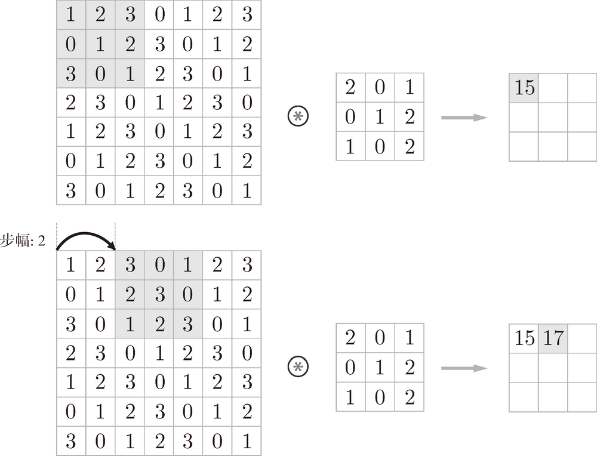

**图 7-7　步幅为 2 的卷积运算的例子**

在图 7-7 的例子中，对输入大小为 (7, 7) 的数据，以步幅 2 应用了滤波器。通过将步幅设为 2，输出大小变为 (3, 3)。像这样，步幅可以指定应用滤波器的间隔。

综上，增大步幅后，输出大小会变小。而增大填充后，输出大小会变大。如果将这样的关系写成算式，会如何呢？接下来，我们看一下对于填充和步幅，如何计算输出大小。

这里，假设输入大小为 (*H*, *W*)，滤波器大小为 (*FH*, *FW*)，输出大小为 (*OH*, *OW*)，填充为 *P*，步幅为 *S*。此时，输出大小可通过式 (7.1) 进行计算。

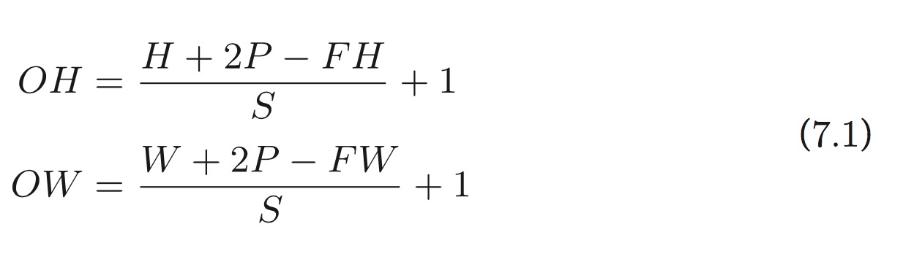

现在，我们使用这个算式，试着做几个计算。

**例 1：图 7-6 的例子**

> 输入大小：(4, 4)；填充：1；步幅：1；滤波器大小：(3, 3)

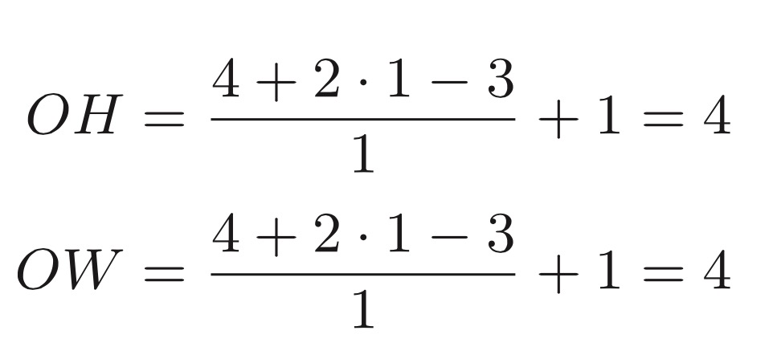

**例 2：图 7-7 的例子**

> 输入大小：(7, 7)；填充：0；步幅：2；滤波器大小：(3, 3)

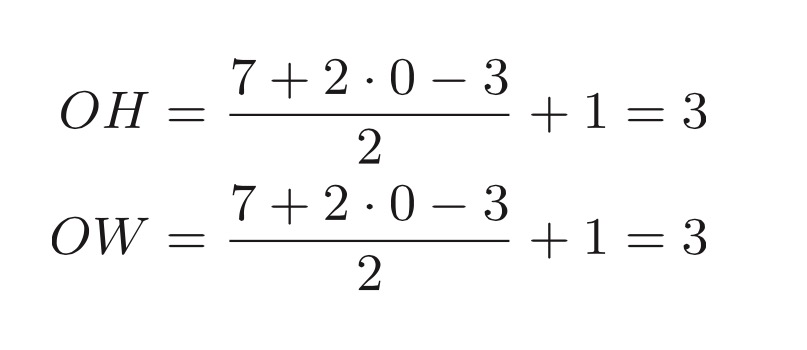

**例 3**

> 输入大小：(28, 31)；填充：2；步幅：3；滤波器大小：(5, 5)

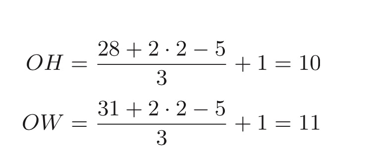

如这些例子所示，通过在式（7.1）中代入值，就可以计算输出大小。这里需要注意的是，虽然只要代入值就可以计算输出大小，但是所设定的值必须使式（7.1）中的 .latex) 和 .latex) 分别可以除尽。当输出大小无法除尽时（结果是小数时），需要采取报错等对策。顺便说一下，根据深度学习的框架的不同，当值无法除尽时，有时会向最接近的整数四舍五入，不进行报错而继续运行。

#### 7.2.5　3 维数据的卷积运算

之前的卷积运算的例子都是以有高、长方向的 2 维形状为对象的。但是，图像是 3 维数据，除了高、长方向之外，还需要处理通道方向。这里，我们按照与之前相同的顺序，看一下对加上了通道方向的 3 维数据进行卷积运算的例子。

图 7-8 是卷积运算的例子，图 7-9 是计算顺序。这里以 3 通道的数据为例，展示了卷积运算的结果。和 2 维数据时（图 7-3 的例子）相比，可以发现纵深方向（通道方向）上特征图增加了。通道方向上有多个特征图时，会按通道进行输入数据和滤波器的卷积运算，并将结果相加，从而得到输出。

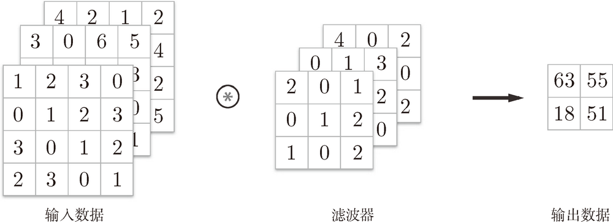

**图 7-8　对 3 维数据进行卷积运算的例子**

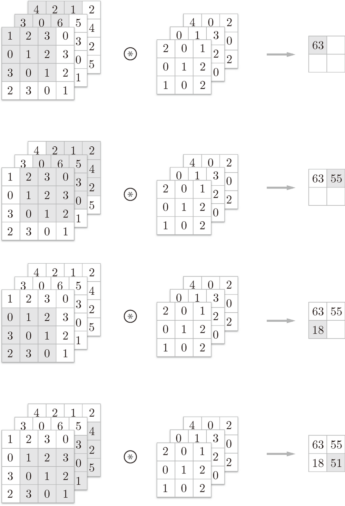

**图 7-9　对 3 维数据进行卷积运算的计算顺序**

需要注意的是，在 3 维数据的卷积运算中，输入数据和滤波器的通道数要设为相同的值。在这个例子中，输入数据和滤波器的通道数一致，均为 3。滤波器大小可以设定为任意值（不过，每个通道的滤波器大小要全部相同）。这个例子中滤波器大小为 (3, 3)，但也可以设定为 (2, 2)、(1, 1)、(5, 5) 等任意值。再强调一下，通道数只能设定为和输入数据的通道数相同的值（本例中为 3）。

#### 7.2.6　结合方块思考

将数据和滤波器结合长方体的方块来考虑，3 维数据的卷积运算会很容易理解。方块是如图 7-10 所示的 3 维长方体。把 3 维数据表示为多维数组时，写顺序为（channel, height, width）。比如，通道数为 *C*、高度为 *H*、长度为 *W* 的数据的形状可以写成（*C*, *H*, *W*）。滤波器也一样，要按（channel, height, width）的顺序写。比如，通道数为 *C*、滤波器高度为 *FH*（Filter Height）、长度为 *FW*（Filter Width）时，可以写成（*C*, *FH*, *FW*）。

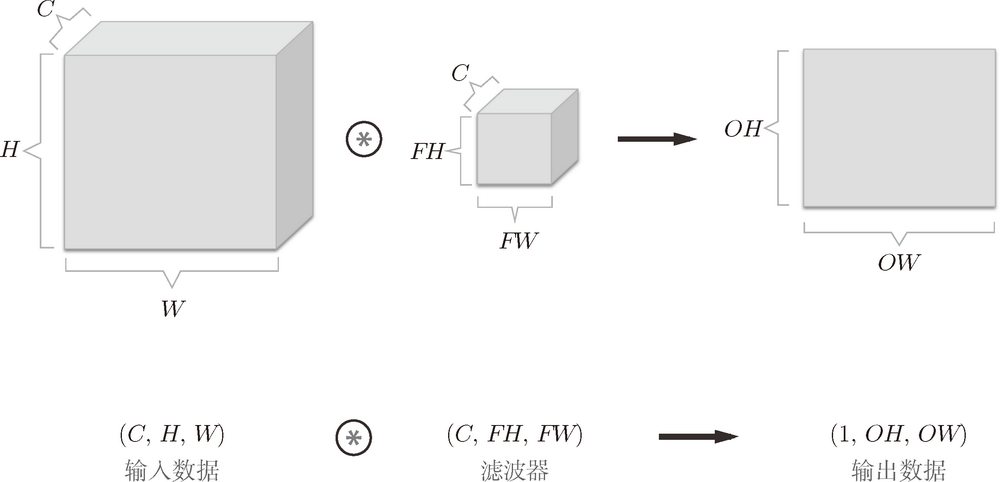

**图 7-10　结合方块思考卷积运算。请注意方块的形状**

在这个例子中，数据输出是 1 张特征图。所谓 1 张特征图，换句话说，就是通道数为 1 的特征图。那么，如果要在通道方向上也拥有多个卷积运算的输出，该怎么做呢？为此，就需要用到多个滤波器（权重）。用图表示的话，如图 7-11 所示。


**图 7-11　基于多个滤波器的卷积运算的例子**

图 7-11 中，通过应用 *FN* 个滤波器，输出特征图也生成了 *FN* 个。如果将这 *FN* 个特征图汇集在一起，就得到了形状为 (*FN*, *OH*, *OW*) 的方块。将这个方块传给下一层，就是 CNN 的处理流。

如图 7-11 所示，关于卷积运算的滤波器，也必须考虑滤波器的数量。因此，作为 4 维数据，滤波器的权重数据要按 (output_channel, input_channel, height, width) 的顺序写。比如，通道数为 3、大小为 5 × 5 的滤波器有 20 个时，可以写成 (20, 3, 5, 5)。

卷积运算中（和全连接层一样）存在偏置。在图 7-11 的例子中，如果进一步追加偏置的加法运算处理，则结果如下面的图 7-12 所示。

图 7-12 中，每个通道只有一个偏置。这里，偏置的形状是 (*FN*, 1, 1)，滤波器的输出结果的形状是 (*FN*, *OH*, *OW*)。这两个方块相加时，要对滤波器的输出结果 (*FN*, *OH*, *OW*) 按通道加上相同的偏置值。另外，不同形状的方块相加时，可以基于 NumPy 的广播功能轻松实现（1.5.5 节）。

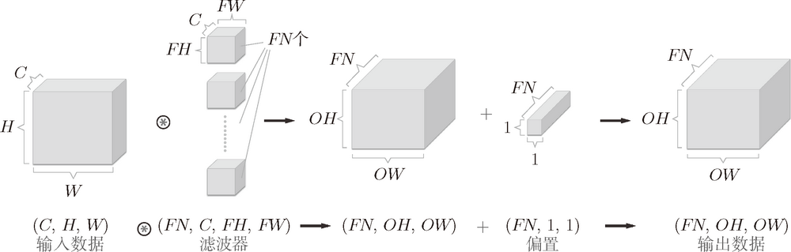

**图 7-12　卷积运算的处理流（追加了偏置项）**

#### 7.2.7　批处理

神经网络的处理中进行了将输入数据打包的批处理。之前的全连接神经网络的实现也对应了批处理，通过批处理，能够实现处理的高效化和学习时对 mini-batch 的对应。

我们希望卷积运算也同样对应批处理。为此，需要将在各层间传递的数据保存为 4 维数据。具体地讲，就是按 (batch_num, channel, height, width) 的顺序保存数据。比如，将图 7-12 中的处理改成对 *N* 个数据进行批处理时，数据的形状如图 7-13 所示。

图 7-13 的批处理版的数据流中，在各个数据的开头添加了批用的维度。像这样，数据作为 4 维的形状在各层间传递。这里需要注意的是，网络间传递的是 4 维数据，对这 *N* 个数据进行了卷积运算。也就是说，批处理将 *N* 次的处理汇总成了 1 次进行。

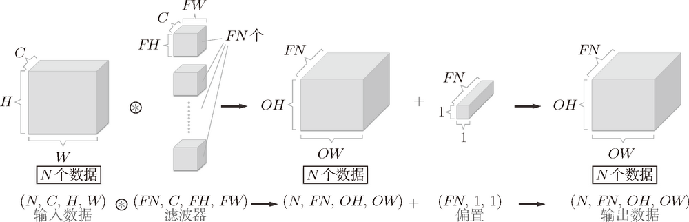

**图 7-13　卷积运算的处理流（批处理）**

### 7.3　池化层

池化是缩小高、长方向上的空间的运算。比如，如图 7-14 所示，进行将 2 × 2 的区域集约成 1 个元素的处理，缩小空间大小。


**图 7-14　Max 池化的处理顺序**

图 7-14 的例子是按步幅 2 进行 2 × 2 的 Max 池化时的处理顺序。“Max 池化”是获取最大值的运算，“2 × 2”表示目标区域的大小。如图所示，从 2 × 2 的区域中取出最大的元素。此外，这个例子中将步幅设为了 2，所以 2 × 2 的窗口的移动间隔为 2 个元素。另外，一般来说，池化的窗口大小会和步幅设定成相同的值。比如，3 × 3 的窗口的步幅会设为 3，4 × 4 的窗口的步幅会设为 4 等。

> 除了 Max 池化之外，还有 Average 池化等。相对于 Max 池化是从目标区域中取出最大值，Average 池化则是计算目标区域的平均值。在图像识别领域，主要使用 Max 池化。因此，中说到“池化层”时，指的是 Max 池化。

##### **池化层的特征**

池化层有以下特征。

> **没有要学习的参数**
>
> 池化层和卷积层不同，没有要学习的参数。池化只是从目标区域中取最大值（或者平均值），所以不存在要学习的参数。
>
> **通道数不发生变化**
>
> 经过池化运算，输入数据和输出数据的通道数不会发生变化。如图 7-15 所示，计算是按通道独立进行的。
>
> 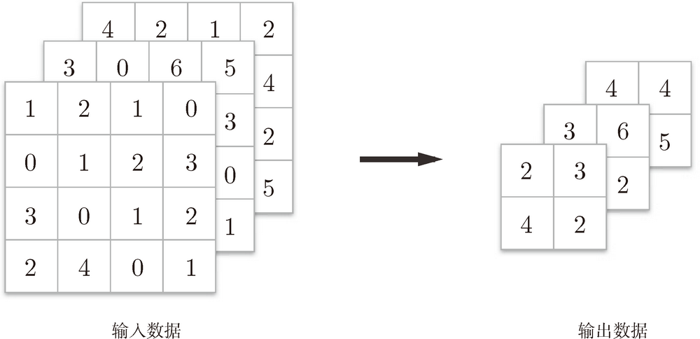
>
> **图 7-15　池化中通道数不变**
>
> **对微小的位置变化具有鲁棒性（健壮）**
>
> 输入数据发生微小偏差时，池化仍会返回相同的结果。因此，池化对输入数据的微小偏差具有鲁棒性。比如，3 × 3 的池化的情况下，如图 7-16 所示，池化会吸收输入数据的偏差（根据数据的不同，结果有可能不一致）。
>
> 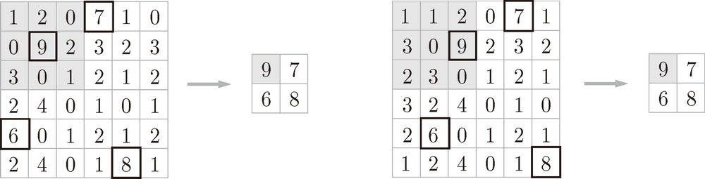
>
> **图 7-16　输入数据在宽度方向上只偏离 1 个元素时，输出仍为相同的结果（根据数据的不同，有时结果也不相同）**

### 7.4　卷积层和池化层的实现

前面我们详细介绍了卷积层和池化层，本节我们就用 Python 来实现这两个层。和第 5 章一样，也给进行实现的类赋予 `forward` 和 `backward` 方法，并使其可以作为模块使用。

大家可能会感觉卷积层和池化层的实现很复杂，但实际上，通过使用某种技巧，就可以很轻松地实现。本节将介绍这种技巧，将问题简化，然后再进行卷积层的实现。

#### 7.4.1　4 维数组

如前所述，CNN 中各层间传递的数据是 4 维数据。所谓 4 维数据，比如数据的形状是 (10, 1, 28, 28)，则它对应 10 个高为 28、长为 28、通道为 1 的数据。用 Python 来实现的话，如下所示。

```
>>> x = np.random.rand(10, 1, 28, 28) # 随机生成数据
>>> x.shape
(10, 1, 28, 28)
```

这里，如果要访问第 1 个数据，只要写 `x[0]` 就可以了（注意 Python 的索引是从 0 开始的）。同样地，用 `x[1]` 可以访问第 2 个数据。

```
>>> x[0].shape # (1, 28, 28)
>>> x[1].shape # (1, 28, 28)
```

如果要访问第 1 个数据的第 1 个通道的空间数据，可以写成下面这样。

```
>>> x[0, 0] # 或者x[0][0]
```

像这样，CNN 中处理的是 4 维数据，因此卷积运算的实现看上去会很复杂，但是通过使用下面要介绍的 `im2col` 这个技巧，问题就会变得很简单。

#### 7.4.2　基于 im2col 的展开

如果老老实实地实现卷积运算，估计要重复好几层的 `for` 语句。这样的实现有点麻烦，而且，NumPy 中存在使用 `for` 语句后处理变慢的缺点（NumPy 中，访问元素时最好不要用 `for` 语句）。这里，我们不使用 `for` 语句，而是使用 `im2col` 这个便利的函数进行简单的实现。

`im2col` 是一个函数，将输入数据展开以适合滤波器（权重）。如图 7-17 所示，对 3 维的输入数据应用 `im2col` 后，数据转换为 2 维矩阵（正确地讲，是把包含批数量的 4 维数据转换成了 2 维数据）。

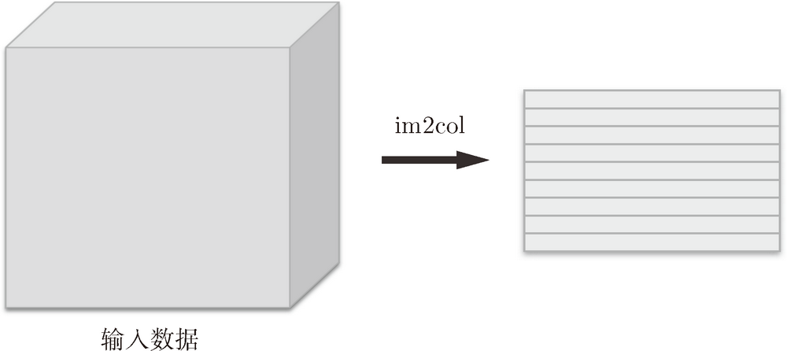

**图 7-17　im2col 的示意图**

`im2col` 会把输入数据展开以适合滤波器（权重）。具体地说，如图 7-18 所示，对于输入数据，将应用滤波器的区域（3 维方块）横向展开为 1 列。`im2col` 会在所有应用滤波器的地方进行这个展开处理。

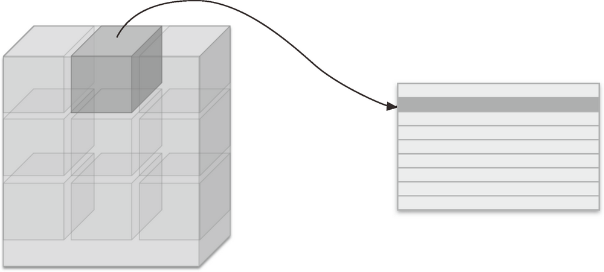

**图 7-18　将滤波器的应用区域从头开始依次横向展开为 1 列**

在图 7-18 中，为了便于观察，将步幅设置得很大，以使滤波器的应用区域不重叠。而在实际的卷积运算中，滤波器的应用区域几乎都是重叠的。在滤波器的应用区域重叠的情况下，使用 `im2col` 展开后，展开后的元素个数会多于原方块的元素个数。因此，使用 `im2col` 的实现存在比普通的实现消耗更多内存的缺点。但是，汇总成一个大的矩阵进行计算，对计算机的计算颇有益处。比如，在矩阵计算的库（线性代数库）等中，矩阵计算的实现已被高度最优化，可以高速地进行大矩阵的乘法运算。因此，通过归结到矩阵计算上，可以有效地利用线性代数库。

> `im2col` 这个名称是“image to column”的缩写，翻译过来就是“从图像到矩阵”的意思。Caffe、Chainer 等深度学习框架中有名为 `im2col` 的函数，并且在卷积层的实现中，都使用了 `im2col`。

使用 `im2col` 展开输入数据后，之后就只需将卷积层的滤波器（权重）纵向展开为 1 列，并计算 2 个矩阵的乘积即可（参照图 7-19）。这和全连接层的 Affine层进行的处理基本相同。

如图 7-19 所示，基于 `im2col` 方式的输出结果是 2 维矩阵。因为 CNN 中数据会保存为 4 维数组，所以要将 2 维输出数据转换为合适的形状。以上就是卷积层的实现流程。

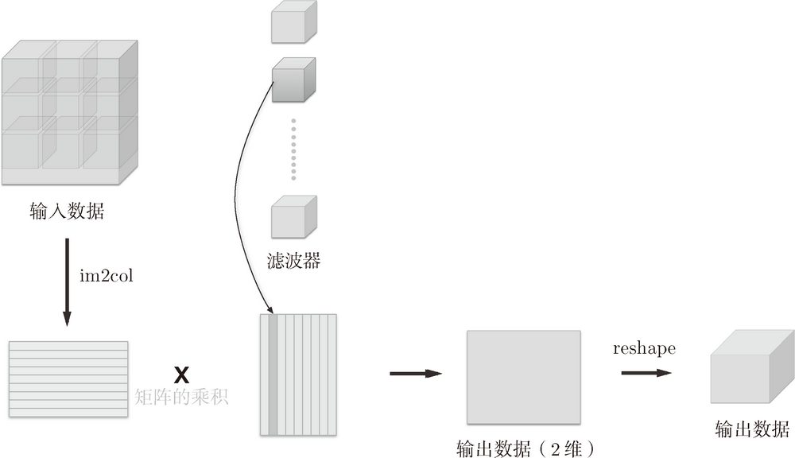

**图 7-19　卷积运算的滤波器处理的细节：将滤波器纵向展开为 1 列，并计算和 im2col 展开的数据的矩阵乘积，最后转换（reshape）为输出数据的大小**

#### 7.4.3　卷积层的实现

提供了 `im2col` 函数，并将这个 `im2col` 函数作为黑盒（不关心内部实现）使用。`im2col` 的实现内容在 `common/util.py` 中，它的实现（实质上）是一个 10 行左右的简单函数。有兴趣的读者可以参考。

`im2col` 这一便捷函数具有以下接口。

```
im2col (input_data, filter_h, filter_w, stride=1, pad=0)
```

> - `input_data`——由（数据量，通道，高，长）的 4 维数组构成的输入数据
> - `filter_h`——滤波器的高
> - `filter_w`——滤波器的长
> - `stride`——步幅
> - `pad`——填充

`im2col` 会考虑滤波器大小、步幅、填充，将输入数据展开为 2 维数组。现在，我们来实际使用一下这个 `im2col`。

```
import sys, os
sys.path.append(os.pardir)
from common.util import im2col

x1 = np.random.rand(1, 3, 7, 7)
col1 = im2col(x1, 5, 5, stride=1, pad=0)
print(col1.shape) # (9, 75)

x2 = np.random.rand(10, 3, 7, 7) # 10个数据
col2 = im2col(x2, 5, 5, stride=1, pad=0)
print(col2.shape) # (90, 75)
```

这里举了两个例子。第一个是批大小为 1、通道为 3 的 7 × 7 的数据，第二个的批大小为 10，数据形状和第一个相同。分别对其应用 `im2col` 函数，在这两种情形下，第 2 维的元素个数均为 75。这是滤波器（通道为 3、大小为 5 × 5）的元素个数的总和。批大小为 1 时，`im2col` 的结果是 `(9, 75)`。而第 2 个例子中批大小为 10，所以保存了 10 倍的数据，即 `(90, 75)`。

现在使用`im2col` 来实现卷积层。这里我们将卷积层实现为名为`Convolution` 的类。

```
    class Convolution:
    def __init__(self, W, b, stride=1, pad=0):
        self.W = W
        self.b = b
        self.stride = stride
        self.pad = pad

    def forward(self, x):
        FN, C, FH, FW = self.W.shape
        N, C, H, W = x.shape
        out_h = int(1 + (H + 2*self.pad - FH) / self.stride)
        out_w = int(1 + (W + 2*self.pad - FW) / self.stride)

        col = im2col(x, FH, FW, self.stride, self.pad)
        col_W = self.W.reshape(FN, -1).T # 滤波器的展开
        out = np.dot(col, col_W) + self.b

        out = out.reshape(N, out_h, out_w, -1).transpose(0, 3, 1, 2)

        return out
```

卷积层的初始化方法将滤波器（权重）、偏置、步幅、填充作为参数接收。滤波器是 `(FN, C, FH, FW)` 的 4 维形状。另外，`FN`、`C`、`FH`、`FW` 分别是 Filter Number（滤波器数量）、Channel、Filter Height、Filter Width 的缩写。

这里用粗体字表示 Convolution 层的实现中的重要部分。在这些粗体字部分，用 `im2col` 展开输入数据，并用 `reshape` 将滤波器展开为 2 维数组。然后，计算展开后的矩阵的乘积。

展开滤波器的部分（代码段中的粗体字）如图 7-19 所示，将各个滤波器的方块纵向展开为 1 列。这里通过 `reshape(FN,-1)` 将参数指定为 `-1`，这是 `reshape` 的一个便利的功能。通过在 `reshape` 时指定为 `-1`，`reshape` 函数会自动计算 `-1` 维度上的元素个数，以使多维数组的元素个数前后一致。比如，(10, 3, 5, 5) 形状的数组的元素个数共有 750 个，指定 `reshape(10,-1)` 后，就会转换成 (10, 75) 形状的数组。

`forward` 的实现中，最后会将输出大小转换为合适的形状。转换时使用了 NumPy 的 `transpose` 函数。`transpose` 会更改多维数组的轴的顺序。如图 7-20 所示，通过指定从 0 开始的索引（编号）序列，就可以更改轴的顺序。

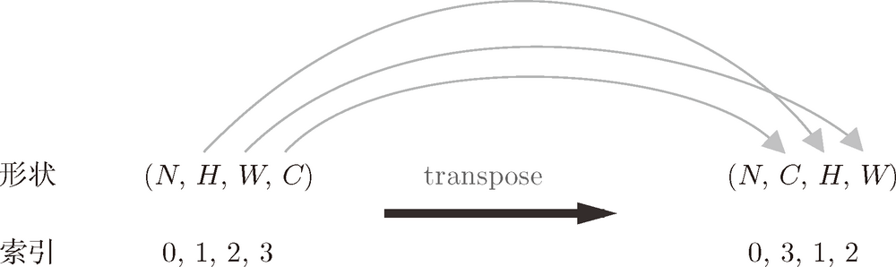

**图 7-20　基于 NumPy 的 transpose 的轴顺序的更改：通过指定索引（编号），更改轴的顺序**

以上就是卷积层的 `forward` 处理的实现。通过使用 `im2col` 进行展开，基本上可以像实现全连接层的 Affine 层一样来实现（5.6 节）。接下来是卷积层的反向传播的实现，因为和 Affine 层的实现有很多共通的地方，所以就不再介绍了。但有一点需要注意，在进行卷积层的反向传播时，必须进行 `im2col` 的逆处理。这可以使用提供的 `col2im` 函数（`col2im` 的实现在 `common/util.py`中）来进行。除了使用 `col2im` 这一点，卷积层的反向传播和 Affine 层的实现方式都一样。卷积层的反向传播的实现在 `common/layer.py` 中，有兴趣的读者可以参考。

#### 7.4.4　池化层的实现

池化层的实现和卷积层相同，都使用 `im2col` 展开输入数据。不过，池化的情况下，在通道方向上是独立的，这一点和卷积层不同。具体地讲，如图 7-21 所示，池化的应用区域按通道单独展开。

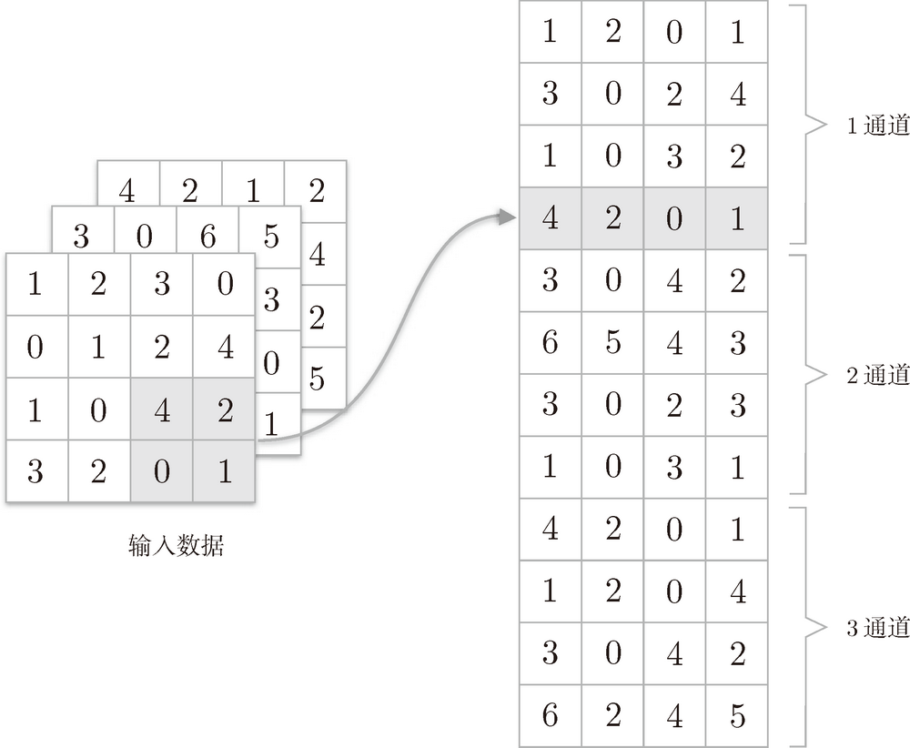

**图 7-21　对输入数据展开池化的应用区域（2×2 的池化的例子）**

像这样展开之后，只需对展开的矩阵求各行的最大值，并转换为合适的形状即可（图 7-22）。

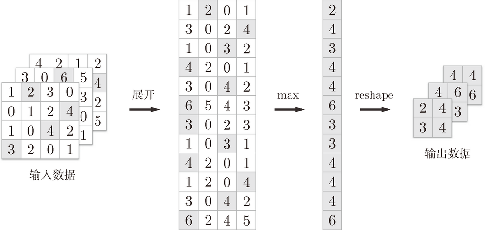

**图 7-22　池化层的实现流程：池化的应用区域内的最大值元素用灰色表示**

上面就是池化层的 `forward` 处理的实现流程。下面来看一下 Python 的实现示例。

```
class Pooling:
    def __init__(self, pool_h, pool_w, stride=1, pad=0):
        self.pool_h = pool_h
        self.pool_w = pool_w
        self.stride = stride
        self.pad = pad

    def forward(self, x):
        N, C, H, W = x.shape
        out_h = int(1 + (H - self.pool_h) / self.stride)
        out_w = int(1 + (W - self.pool_w) / self.stride)

        # 展开(1)
        col = im2col(x, self.pool_h, self.pool_w, self.stride, self.pad)
        col = col.reshape(-1, self.pool_h*self.pool_w)

        # 最大值(2)
        out = np.max(col, axis=1)
        # 转换(3)
        out = out.reshape(N, out_h, out_w, C).transpose(0, 3, 1, 2)

        return out
```

如图 7-22 所示，池化层的实现按下面 3 个阶段进行。

> 1. 展开输入数据。
> 2. 求各行的最大值。
> 3. 转换为合适的输出大小。

各阶段的实现都很简单，只有一两行代码。

> 最大值的计算可以使用 NumPy 的 `np.max` 方法。`np.max` 可以指定 `axis` 参数，并在这个参数指定的各个轴方向上求最大值。比如，如果写成 `np.max(x, axis=1)`，就可以在输入 `x` 的第 1 维的各个轴方向上求最大值。

以上就是池化层的 `forward` 处理的介绍。如上所述，通过将输入数据展开为容易进行池化的形状，后面的实现就会变得非常简单。

关于池化层的 `backward` 处理，之前已经介绍过相关内容，这里就不再介绍了。另外，池化层的 `backward` 处理可以参考 ReLU 层的实现中使用的 max 的反向传播（5.5.1 节）。池化层的实现在 `common/layer.py` 中，有兴趣的读者可以参考。

### 7.5　CNN 的实现

我们已经实现了卷积层和池化层，现在来组合这些层，搭建进行手写数字识别的 CNN。这里要实现如图 7-23 所示的 CNN。

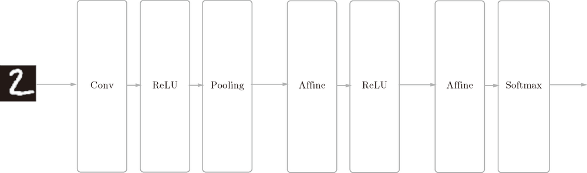

**图 7-23　简单 CNN 的网络构成**

如图 7-23 所示，网络的构成是“Convolution - ReLU - Pooling -Affine - ReLU - Affine - Softmax”，我们将它实现为名为 `SimpleConvNet` 的类。

首先来看一下 `SimpleConvNet` 的初始化（`__init__`），取下面这些参数。

**参数**

> - `input_dim`——输入数据的维度：（通道，高，长）
>
> - `conv_param`——卷积层的超参数（字典）。字典的关键字如下：
>
>   `filter_num`——滤波器的数量
>
>   `filter_size`——滤波器的大小
>
>   `stride`——步幅
>
>   `pad`——填充
>
> - `hidden_size`——隐藏层（全连接）的神经元数量
>
> - `output_size`——输出层（全连接）的神经元数量
>
> - `weitght_int_std`——初始化时权重的标准差

这里，卷积层的超参数通过名为 `conv_param` 的字典传入。我们设想它会像 `{'filter_num':30,'filter_size':5, 'pad':0, 'stride':1}` 这样，保存必要的超参数值。

`SimpleConvNet` 的初始化的实现稍长，我们分成 3 部分来说明，首先是初始化的最开始部分。

```
class SimpleConvNet:
    def __init__(self, input_dim=(1, 28, 28),
                 conv_param={'filter_num':30, 'filter_size':5,
                             'pad':0, 'stride':1},
                 hidden_size=100, output_size=10, weight_init_std=0.01):
        filter_num = conv_param['filter_num']
        filter_size = conv_param['filter_size']
        filter_pad = conv_param['pad']
        filter_stride = conv_param['stride']
        input_size = input_dim[1]
        conv_output_size = (input_size - filter_size + 2*filter_pad) / \
                            filter_stride + 1
        pool_output_size = int(filter_num * (conv_output_size/2) *
                               (conv_output_size/2))
```

这里将由初始化参数传入的卷积层的超参数从字典中取了出来（以方便后面使用），然后，计算卷积层的输出大小。接下来是权重参数的初始化部分。

```
self.params = {}
self.params['W1'] = weight_init_std * \
                    np.random.randn(filter_num, input_dim[0],
                                    filter_size, filter_size)
self.params['b1'] = np.zeros(filter_num)
self.params['W2'] = weight_init_std * \
                    np.random.randn(pool_output_size,
                                    hidden_size)
self.params['b2'] = np.zeros(hidden_size)
self.params['W3'] = weight_init_std * \
                    np.random.randn(hidden_size, output_size)
self.params['b3'] = np.zeros(output_size)
```

学习所需的参数是第 1 层的卷积层和剩余两个全连接层的权重和偏置。将这些参数保存在实例变量的 `params` 字典中。将第 1 层的卷积层的权重设为关键字 `W1`，偏置设为关键字 `b1`。同样，分别用关键字 `W2`、`b2` 和关键字 `W3`、`b3` 来保存第 2 个和第 3 个全连接层的权重和偏置。

最后，生成必要的层。

```
self.layers = OrderedDict()
self.layers['Conv1'] = Convolution(self.params['W1'],
                                   self.params['b1'],
                                   conv_param['stride'],
                                   conv_param['pad'])

self.layers['Relu1'] = Relu()
self.layers['Pool1'] = Pooling(pool_h=2, pool_w=2, stride=2)
self.layers['Affine1'] = Affine(self.params['W2'],
                              self.params['b2'])

self.layers['Relu2'] = Relu()
self.layers['Affine2'] = Affine(self.params['W3'],
                              self.params['b3'])
self.last_layer = softmaxwithloss()
```

从最前面开始按顺序向有序字典（`OrderedDict`）的 `layers` 中添加层。只有最后的 `SoftmaxWithLoss` 层被添加到别的变量 `lastLayer` 中。

以上就是 `SimpleConvNet` 的初始化中进行的处理。像这样初始化后，进行推理的 `predict` 方法和求损失函数值的 `loss` 方法就可以像下面这样实现。

```
def predict(self, x):
    for layer in self.layers.values():
        x = layer.forward(x)
    return x

def loss(self, x, t):
    y = self.predict(x)
    return self.lastLayer.forward(y, t)
```

这里，参数 `x` 是输入数据，`t` 是教师标签。用于推理的 `predict` 方法从头开始依次调用已添加的层，并将结果传递给下一层。在求损失函数的 `loss` 方法中，除了使用 `predict` 方法进行的 `forward` 处理之外，还会继续进行 `forward` 处理，直到到达最后的 `SoftmaxWithLoss` 层。

接下来是基于误差反向传播法求梯度的代码实现。

```
def gradient(self, x, t):
    # forward
    self.loss(x, t)

    # backward
    dout = 1
    dout = self.lastLayer.backward(dout)

    layers = list(self.layers.values())
    layers.reverse()
    for layer in layers:
        dout = layer.backward(dout)

    # 设定
    grads = {}
    grads['W1'] = self.layers['Conv1'].dW
    grads['b1'] = self.layers['Conv1'].db
    grads['W2'] = self.layers['Affine1'].dW
    grads['b2'] = self.layers['Affine1'].db
    grads['W3'] = self.layers['Affine2'].dW
    grads['b3'] = self.layers['Affine2'].db

    return grads
```

参数的梯度通过误差反向传播法（反向传播）求出，通过把正向传播和反向传播组装在一起来完成。因为已经在各层正确实现了正向传播和反向传播的功能，所以这里只需要以合适的顺序调用即可。最后，把各个权重参数的梯度保存到 `grads` 字典中。这就是 `SimpleConvNet` 的实现。

现在，使用这个 `SimpleConvNet` 学习 MNIST 数据集。用于学习的代码与 4.5 节中介绍的代码基本相同，因此这里不再罗列（源代码在 `ch07/train_convnet.py` 中）。

如果使用 MNIST 数据集训练 `SimpleConvNet`，则训练数据的识别率为 99.82%，测试数据的识别率为 98.96%（每次学习的识别精度都会发生一些误差）。测试数据的识别率大约为 99%，就小型网络来说，这是一个非常高的识别率。下一章，我们会通过进一步叠加层来加深网络，实现测试数据的识别率超过 99% 的网络。

如上所述，卷积层和池化层是图像识别中必备的模块。CNN 可以有效读取图像中的某种特性，在手写数字识别中，还可以实现高精度的识别。

### 7.6　CNN 的可视化

CNN 中用到的卷积层在“观察”什么呢？本节将通过卷积层的可视化，探索 CNN 中到底进行了什么处理。

#### 7.6.1　第 1 层权重的可视化

刚才我们对 MNIST 数据集进行了简单的 CNN 学习。当时，第 1 层的卷积层的权重的形状是 (30, 1, 5, 5)，即 30 个大小为 5 × 5、通道为 1 的滤波器。滤波器大小是 5 × 5、通道数是 1，意味着滤波器可以可视化为 1 通道的灰度图像。现在，我们将卷积层（第 1 层）的滤波器显示为图像。这里，我们来比较一下学习前和学习后的权重，结果如图 7-24 所示（源代码在 `ch07/visualize_filter.py`中）。

图 7-24 中，学习前的滤波器是随机进行初始化的，所以在黑白的浓淡上没有规律可循，但学习后的滤波器变成了有规律的图像。我们发现，通过学习，滤波器被更新成了有规律的滤波器，比如从白到黑渐变的滤波器、含有块状区域（称为 blob）的滤波器等。

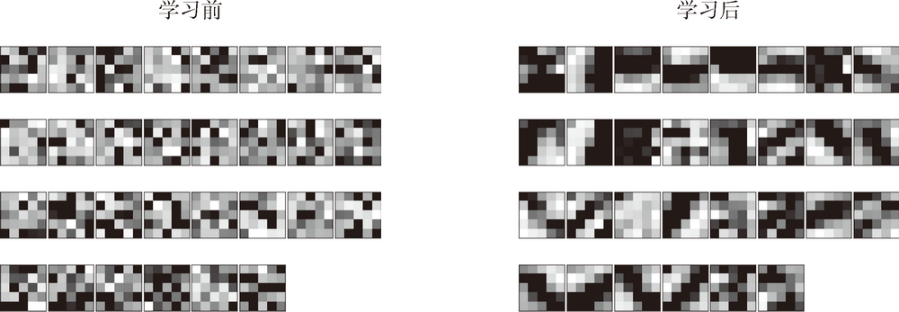

**图 7-24　学习前和学习后的第 1 层的卷积层的权重：虽然权重的元素是实数，但是在图像的显示上，统一将最小值显示为黑色（0），最大值显示为白色（255）**

如果要问图 7-24 中右边的有规律的滤波器在“观察”什么，答案就是它在观察边缘（颜色变化的分界线）和斑块（局部的块状区域）等。比如，左半部分为白色、右半部分为黑色的滤波器的情况下，如图 7-25 所示，会对垂直方向上的边缘有响应。

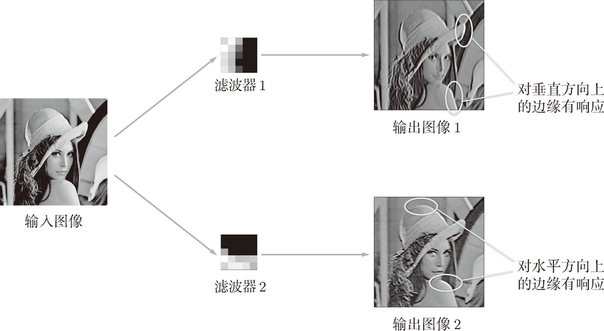

**图 7-25　对水平方向上和垂直方向上的边缘有响应的滤波器：输出图像 1 中，垂直方向的边缘上出现白色像素，输出图像 2 中，水平方向的边缘上出现很多白色像素**

图 7-25 中显示了选择两个学习完的滤波器对输入图像进行卷积处理时的结果。我们发现“滤波器 1”对垂直方向上的边缘有响应，“滤波器 2”对水平方向上的边缘有响应。

由此可知，卷积层的滤波器会提取边缘或斑块等原始信息。而刚才实现的 CNN 会将这些原始信息传递给后面的层。

#### 7.6.2　基于分层结构的信息提取

上面的结果是针对第 1 层的卷积层得出的。第 1 层的卷积层中提取了边缘或斑块等“低级”信息，那么在堆叠了多层的 CNN 中，各层中又会提取什么样的信息呢？根据深度学习的可视化相关的研究 [17][18]，随着层次加深，提取的信息（正确地讲，是反映强烈的神经元）也越来越抽象。

图 7-26 中展示了进行一般物体识别（车或狗等）的 8 层 CNN。这个网络结构的名称是下一节要介绍的 AlexNet。AlexNet 网络结构堆叠了多层卷积层和池化层，最后经过全连接层输出结果。图 7-26 的方块表示的是中间数据，对于这些中间数据，会连续应用卷积运算。


**图 7-26　CNN 的卷积层中提取的信息。第 1 层的神经元对边缘或斑块有响应，第 3 层对纹理有响应，第 5 层对物体部件有响应，最后的全连接层对物体的类别（狗或车）有响应（图像引用自文献 [19]）**

如图 7-26 所示，如果堆叠了多层卷积层，则随着层次加深，提取的信息也愈加复杂、抽象，这是深度学习中很有意思的一个地方。最开始的层对简单的边缘有响应，接下来的层对纹理有响应，再后面的层对更加复杂的物体部件有响应。也就是说，随着层次加深，神经元从简单的形状向“高级”信息变化。换句话说，就像我们理解东西的“含义”一样，响应的对象在逐渐变化。

### 7.7　具有代表性的 CNN

关于 CNN，迄今为止已经提出了各种网络结构。这里，我们介绍其中特别重要的两个网络，一个是在 1998 年首次被提出的 CNN 元祖 LeNet[20]，另一个是在深度学习受到关注的 2012 年被提出的 AlexNet[21]。

#### 7.7.1　LeNet

LeNet 在 1998 年被提出，是进行手写数字识别的网络。如图 7-27 所示，它有连续的卷积层和池化层（正确地讲，是只“抽选元素”的子采样层），最后经全连接层输出结果。

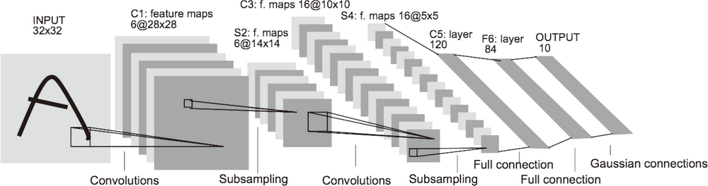

**图 7-27　LeNet 的网络结构（引用自文献 [20]）**

和“现在的 CNN”相比，LeNet 有几个不同点。第一个不同点在于激活函数。LeNet 中使用 sigmoid 函数，而现在的 CNN 中主要使用 ReLU 函数。此外，原始的 LeNet 中使用子采样（subsampling）缩小中间数据的大小，而现在的 CNN 中 Max 池化是主流。

综上，LeNet 与现在的 CNN 虽然有些许不同，但差别并不是那么大。想到 LeNet 是 20 多年前提出的最早的 CNN，还是很令人称奇的。

#### 7.7.2　AlexNet

在 LeNet 问世 20 多年后，AlexNet 被发布出来。AlexNet 是引发深度学习热潮的导火线，不过它的网络结构和 LeNet 基本上没有什么不同，如图 7-28 所示。

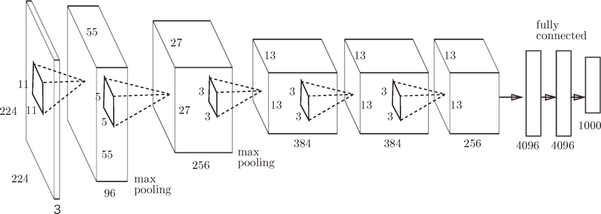

**图 7-28　AlexNet（根据文献 [21] 生成）**

AlexNet 叠有多个卷积层和池化层，最后经由全连接层输出结果。虽然结构上 AlexNet 和 LeNet 没有大的不同，但有以下几点差异。

> - 激活函数使用 ReLU。
> - 使用进行局部正规化的 LRN（Local Response Normalization）层。
> - 使用 Dropout（6.4.3 节）。

如上所述，关于网络结构，LeNet 和 AlexNet 没有太大的不同。但是，围绕它们的环境和计算机技术有了很大的进步。具体地说，现在任何人都可以获得大量的数据。而且，擅长大规模并行计算的 GPU 得到普及，高速进行大量的运算已经成为可能。大数据和 GPU 已成为深度学习发展的巨大的原动力。

> 大多数情况下，深度学习（加深了层次的网络）存在大量的参数。因此，学习需要大量的计算，并且需要使那些参数“满意”的大量数据。可以说是 GPU 和大数据给这些课题带来了希望。

